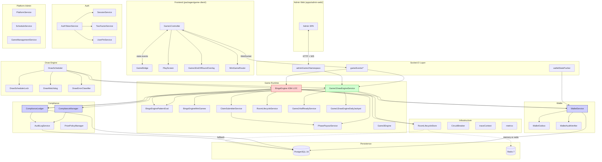

# Spillorama Module Map — Master Index

**Last reviewed:** 2026-04-30
**Maintained by:** auto-generation script + manual per-module README authoring (Bølge F1).
**Scope:** Live bingo platform — backend (`apps/backend/`), frontend game-client (`packages/game-client/`), admin web (`apps/admin-web/`), shared types (`packages/shared-types/`).

This document is the single source of truth for understanding the system layout. Every developer + auditor + ops-on-call should be able to start here, find the relevant module, and read its README to understand purpose + public API + invariants + operational notes.

---

## 1. System overview (3-tier)

```
┌─────────────────────────────────────────────────────────────────────┐
│                     Pengespill operatør / regulator                  │
└──────────────────────────────────┬──────────────────────────────────┘
                                   │ §11/§71 audit
                                   ▼
┌─────────────────────────────────────────────────────────────────────┐
│                        Backend (apps/backend/)                       │
│                                                                      │
│  Express + Socket.IO server, runtime-eieren av all spillstate.      │
│  PostgreSQL = source-of-truth. Redis = ephemeral cache + locks.      │
│                                                                      │
│  Modul-områder:                                                      │
│    • game-runtime  (BingoEngine, Game1DrawEngineService, …)         │
│    • wallet        (WalletService, outbox, audit-chain)             │
│    • compliance    (ComplianceManager, Ledger, AuditLog)            │
│    • draw-engine   (DrawScheduler, DrawWatchdog)                    │
│    • auth          (AuthTokenService, TwoFactor, PIN, sessions)     │
│    • platform-admin (PlatformService, ScheduleService, agent CRUD)  │
│    • payments      (Swedbank, manual deposit/withdraw queue)        │
│    • integration   (Metronia, OK Bingo, e-mail, SMS)                │
│    • infrastructure (RoomLifecycleStore, CircuitBreaker, traceCtx)  │
└──────────────────────────────────┬──────────────────────────────────┘
                                   │ HTTP + Socket.IO
                                   ▼
   ┌──────────────────────────┐    ┌────────────────────────────┐
   │  Frontend game-client    │    │  Admin web                 │
   │  (packages/game-client)  │    │  (apps/admin-web)          │
   │                          │    │                            │
   │  Pixi.js spill-runtime   │    │  Static Vite SPA           │
   │  + HTML overlays         │    │  Hall management,          │
   │  + WebSocket-bridge      │    │  player KYC, rapporter,    │
   │                          │    │  agent-portal              │
   └──────────────────────────┘    └────────────────────────────┘
```

---

## 2. Mermaid system-graph (high-level)



**Color-key:**
- 🔴 Red = legacy / refactor-candidate (BingoEngine — 4364 LOC after F2-A + F2-B + F2-C extractions, HV-3 candidate)
- 🟢 Green = canonical retail-Spill 1 path (Game1DrawEngineService, post-K3-quarantine)
- 🔵 Blue = compliance-critical (wallet, ledger, audit) — touch with extreme care

---

## 3. Module index — backend

Click into each per-module README for purpose, public API, dependencies, invariants, test coverage.

### 3.1 Game runtime (`apps/backend/src/game/`)

| Module | LOC | Role | README |
|---|---:|---|---|
| `BingoEngine` | 4364 | Multi-game ad-hoc engine (Spill 2/3 + test-hall Spill 1 post-K3) | [📄](./modules/backend/BingoEngine.md) |
| `Game1DrawEngineService` | 3103 | Scheduled-engine for prod retail Spill 1 | [📄](./modules/backend/Game1DrawEngineService.md) |
| `BingoEnginePatternEval` | 1100+ | Pattern-evaluator + auto-claim multi-phase | [📄](./modules/backend/BingoEnginePatternEval.md) |
| `BingoEngineMiniGames` | 380 | Mini-game integration (wheel/chest/colordraft/mystery/oddsen) | [📄](./modules/backend/BingoEngineMiniGames.md) |
| `BingoEngineRecovery` | 290 | Round-recovery after server-restart | [📄](./modules/backend/BingoEngineRecovery.md) |
| `PhasePayoutService` | 318 | Cap-and-transfer flow (extracted F2-A — used by `BingoEngine` + `ClaimSubmitterService`) | [📄](./modules/backend/PhasePayoutService.md) |
| `ClaimSubmitterService` | 1158 | Claim-submission flow (validation + LINE/BINGO + post-transfer audit-trail; extracted F2-B from `BingoEngine`) | [📄](./modules/backend/ClaimSubmitterService.md) |
| `RoomLifecycleService` | 471 | Room-lifecycle flow (createRoom/joinRoom/destroyRoom + read-side projections; extracted F2-C from `BingoEngine`) | [📄](./modules/backend/RoomLifecycleService.md) |
| `Game3Engine` | TBD | Spill 3 (alternative game variant) | [📄](./modules/backend/Game3Engine.md) |
| `Game1AutoDrawTickService` | 400 | Auto-draw tick-loop for scheduled Spill 1 | [📄](./modules/backend/Game1AutoDrawTickService.md) |
| `Game1HallReadyService` | 950 | Multi-hall ready-state machine | [📄](./modules/backend/Game1HallReadyService.md) |
| `Game1DrawEngineDailyJackpot` | 290 | Daily jackpot accumulation (4000/day, max 30k) | [📄](./modules/backend/Game1DrawEngineDailyJackpot.md) |
| `ComplianceLedger` | 600 | §11/§71-event-skriving | [📄](./modules/backend/ComplianceLedger.md) |
| `MiniGames overview` | — | `apps/backend/src/game/minigames/`-folder | [📄](./modules/backend/MiniGames-overview.md) |

### 3.2 Wallet (`apps/backend/src/wallet/`, `apps/backend/src/services/`)

| Module | Role | README |
|---|---|---|
| `WalletService` | Core balance + transfer + idempotency | [📄](./modules/backend/WalletService.md) |
| `WalletOutboxRepo` | Outbox-pattern for at-least-once wallet-credit | apps/backend/src/wallet/WalletOutboxRepo.ts |
| `WalletAuditVerifier` | Hash-chain audit (BIN-764) | apps/backend/src/wallet/WalletAuditVerifier.ts |
| `WalletReservationExpiryService` | Pre-round-reservation TTL | apps/backend/src/wallet/WalletReservationExpiryService.ts |

### 3.3 Compliance (`apps/backend/src/compliance/`, `apps/backend/src/game/Compliance*`)

| Module | Role | README |
|---|---|---|
| `ComplianceManager` | Tap-grenser (§22), self-exclusion (§23), obligatory pause (§66) | [📄](./modules/backend/ComplianceManager.md) |
| `PrizePolicyManager` | 2500-kr-cap per enkelt-premie (§11) | [📄](./modules/backend/PrizePolicyManager.md) |
| `AuditLogService` | All admin/wallet-mutating actions | [📄](./modules/backend/AuditLogService.md) |
| `HallAccountReportService` | §11-rapport per hall | apps/backend/src/compliance/HallAccountReportService.ts |
| `LoyaltyService` | Loyalty-tier-management | apps/backend/src/compliance/LoyaltyService.ts |
| `AmlService` | AML-screening | apps/backend/src/compliance/AmlService.ts |

### 3.4 Auth (`apps/backend/src/auth/`)

| Module | Role | README |
|---|---|---|
| `AuthTokenService` | JWT-tokens + opaque session-IDs | [📄](./modules/backend/AuthTokenService.md) |
| `SessionService` | Active sessions + multi-device logout | [📄](./modules/backend/SessionService.md) |
| `TwoFactorService` | TOTP + backup-codes (REQ-129) | [📄](./modules/backend/TwoFactorService.md) |
| `UserPinService` | Phone+PIN-login (REQ-130) | apps/backend/src/auth/UserPinService.ts |
| `PasswordRotationService` | 90-dagers password-rotasjon | apps/backend/src/auth/PasswordRotationService.ts |

### 3.5 Platform admin (`apps/backend/src/platform/`, `apps/backend/src/admin/`)

| Module | Role | README |
|---|---|---|
| `PlatformService` | Hall config + player registrasjon + KYC | [📄](./modules/backend/PlatformService.md) |
| `ScheduleService` | Hall-skjema (uke + dag) | [📄](./modules/backend/ScheduleService.md) |
| `GameManagementService` | Per-spill-konfigurasjon + saved-games | [📄](./modules/backend/GameManagementService.md) |
| `CloseDayService` | Lukke-dag-policies | apps/backend/src/admin/CloseDayService.ts |
| `WithdrawXmlExportService` | Bank-withdraw → XML til regnskap | apps/backend/src/admin/WithdrawXmlExportService.ts |

### 3.6 Draw engine (`apps/backend/src/draw-engine/`)

| Module | Role | README |
|---|---|---|
| `DrawScheduler` | Tick-loop, lock-acquisition, watchdog | [📄](./modules/backend/DrawScheduler.md) |
| `DrawSchedulerLock` | Redis-distributed-lock for single-instance-tick | (subset of DrawScheduler) |
| `DrawWatchdog` | Detect stuck rooms | (subset of DrawScheduler) |
| `DrawErrorClassifier` | Categorize errors (transient/permanent/fatal) | (subset of DrawScheduler) |

### 3.7 Infrastructure (`apps/backend/src/util/`)

| Module | Role | README |
|---|---|---|
| `RoomLifecycleStore` | K2 atomic state owner — InMemory + Redis | [📄](./modules/backend/RoomLifecycleStore.md) |
| `RoomState` | Factory + provider switching | [📄](./modules/backend/RoomState.md) |
| `CircuitBreaker` | Wallet adapter circuit breaker | [📄](./modules/backend/CircuitBreaker.md) |
| `traceContext` | OpenTelemetry-style trace-ID propagation (MED-1) | [📄](./modules/backend/traceContext.md) |
| `metrics` | Prometheus-metrics-katalog | [📄](./modules/backend/metrics.md) |
| `pgPool` | Shared Postgres connection pool | apps/backend/src/util/pgPool.ts |
| `staleRoomBootSweep` | Boot-restore for unended rooms (PR #722) | apps/backend/src/util/staleRoomBootSweep.ts |

### 3.8 Sockets (`apps/backend/src/sockets/`)

See [`EVENT_PROTOCOL.md`](./EVENT_PROTOCOL.md) for the autoritative socket-event catalog.

| Module | Role |
|---|---|
| `gameEvents/claimEvents` | claim:submit handler (BIN-545 Zod-validated payload) |
| `gameEvents/roomEvents` | bet:arm, room:join, room:leave |
| `gameEvents/drawEvents` | draw:next (admin), draw:new (broadcast) |
| `gameEvents/lifecycleEvents` | game:start, game:end |
| `gameEvents/miniGameEvents` | minigame:play, jackpot:spin |
| `gameEvents/chatEvents` | chat:send, chat:history |
| `gameEvents/voucherEvents` | voucher:redeem |
| `gameEvents/stopVoteEvents` | player-initiated stop-game-vote (GAP #38) |
| `adminGame1Namespace` | Admin-side socket namespace |
| `walletStatePusher` | Push wallet-state on balance change |
| `miniGameSocketWire` | Wire mini-game-state to client |

---

## 4. Module index — frontend (`packages/game-client/`)

| Module | Role | README |
|---|---|---|
| `Game1Controller` | Main orchestrator for Spill 1 PixiJS UI | [📄](./modules/frontend/Game1Controller.md) |
| `GameBridge` | Socket-state-bridge → controller events | [📄](./modules/frontend/GameBridge.md) |
| `PlayScreen` | Main playing-screen (cards + draws + chat) | [📄](./modules/frontend/PlayScreen.md) |
| `MiniGameRouter` | Wheel/Chest/Mystery/ColorDraft router | [📄](./modules/frontend/MiniGameRouter.md) |
| `Game1EndOfRoundOverlay` | Post-PR #737: combined Summary + Loading + markRoomReady | [📄](./modules/frontend/Game1EndOfRoundOverlay.md) |
| `LegacyMiniGameAdapter` | Adapter for `minigame:activated`-events (PR #728) | packages/game-client/src/games/game1/logic/LegacyMiniGameAdapter.ts |
| `Game1ReconnectFlow` | Reconnect-state-rebuild | packages/game-client/src/games/game1/logic/ReconnectFlow.ts |
| `Game1SocketActions` | Socket-emit-helpers | packages/game-client/src/games/game1/logic/SocketActions.ts |

---

## 5. Architectural principles (Evolution Gaming benchmark)

These rules apply to ALL new code. PRs that violate are rejected at review.

### 5.1 Module-isolation
- **No cross-app imports.** `apps/admin-web` never imports from `apps/backend`. If shared, move to `packages/shared-types`.
- **Hexagonal-architecture-light:** business logic in `*Service.ts`, I/O in `*Adapter.ts` / `*Port.ts`.
- **Single-responsibility-per-file:** files > 500 LOC require an explicit decomposition-justification in PR description.

### 5.2 Idempotency
- **Every state-mutating wallet/compliance/payment-operation has an explicit idempotency key.** Never rely on at-most-once delivery.
- **Outbox pattern for cross-system effects** (e.g. `WalletOutboxRepo` for wallet-credit, `ComplianceOutboxRepo` for ledger-events).

### 5.3 Atomicity
- **Multi-step state mutations within a single bounded context use a transaction** (`runInTransaction` helper).
- **Cross-system mutations use saga pattern** — each step has compensating action.
- **State that survives across async boundaries is owned by `RoomLifecycleStore` (K2)** — not module-local Maps.

### 5.4 Observability
- **Every public method emits `addBreadcrumb` on entry + structured log on exit.**
- **Trace-ID propagates from HTTP/Socket entry through every async call** (MED-1, `traceContext.ts`).
- **Errors categorized:** `DomainError` (user-fixable) vs `SystemError` (ops-on-call) — see `errors/DomainError.ts`.

### 5.5 Compliance
- **All wallet-mutating actions write to `AuditLogService`.** Action-name follows `<resource>.<verb>` (e.g. `wallet.transfer`, `player.kyc.approve`).
- **All money-bearing rounds write to `ComplianceLedger`.** §11/§71-data-fields are mandatory.
- **Self-exclusion + obligatory-pause are checked fail-closed** — DB-feil blokkerer spill, ikke åpner.

### 5.6 Testing
- **Unit tests for business logic.** Co-located `*.test.ts`.
- **Compliance tests for regulatory rules.** `npm run test:compliance` is mandatory before merge.
- **Property-based tests for invariants.** `apps/backend/src/__tests__/invariants/` — wallet-balance, pattern-eval, atomicity, draw-bag.
- **Visual regression for game-rendering.** Playwright `npm run test:visual`.
- **Schema CI gate (PR #731).** Shadow Postgres + diff-against-baseline; ghost migrations rejected.

---

## 6. How to add a new module

1. Decide owner-area (game-runtime / wallet / compliance / etc).
2. Write the module under correct folder.
3. **Create `docs/architecture/modules/<area>/<ModuleName>.md`** following the template in this directory's existing READMEs.
4. Add row to the relevant table in this file (§3 or §4).
5. Update Mermaid graph in §2 if it's a major node.
6. PR description must reference the new README.

---

## 7. Known refactor-targets (REFACTOR_AUDIT_PRE_PILOT_2026-04-29.md)

Active backlog tracked in [`docs/audit/REFACTOR_AUDIT_PRE_PILOT_2026-04-29.md`](../audit/REFACTOR_AUDIT_PRE_PILOT_2026-04-29.md). Status:

| Bølge | Title | Status |
|---|---|---|
| K1 | Schema-CI gate + auth-skjema-repair | ✅ Merged (PR #731) |
| K2 | Atomic RoomLifecycleStore | ✅ Merged (PR #732) |
| K3 | Dual-engine-quarantine | ✅ Merged (PR #735) |
| K4 | Redis-backed RoomLifecycleStore | 🟡 PR #738 open |
| K5 | Engine error-handling circuit breaker | ⏸️ Waiting K3+K4 |
| HV-2 | Per-hall daily prize-pool (BIR-036) | ⏸️ Awaiting owner approval |
| HV-3 | BingoEngine extraction (5136 LOC → focused services) | 🆕 Bølge F2 |
| HV-4 | Compliance-ledger consistency (BingoEngine inline → port) | 🆕 Bølge F2 |
| HV-5 | Event-protocol contract document | 🆕 Bølge F1 (this) |
| HV-9 | closeDay atomicity | ✅ Merged (PR #730) |
| HV-12 | Replay integrity tests | 🆕 Bølge F2 |

---

## 8. Auto-generation

`apps/backend/scripts/generate-module-map.ts` parses imports across all modules and rebuilds:
- The Mermaid graph in §2
- The module tables in §3 + §4 (LOC counts + file paths)

Run via:

```bash
npm --prefix apps/backend exec tsx scripts/generate-module-map.ts
```

This script SHOULD be wired to a CI gate (TODO Bølge F1 follow-up): `if any new .ts file is added without a matching `docs/architecture/modules/.../<File>.md`, fail CI`. This forces every new module to ship with documentation.

---

## 9. Glossary

| Term | Meaning |
|---|---|
| **Bølge** | "Wave" — discrete, atomic refactor effort with single PR scope. |
| **§11/§71** | Pengespillforskriften (Norwegian gambling regulation) sections — overskudd til organisasjoner / multi-hall actor binding. |
| **Hall** | Physical bingo location. Spillorama drives ~27 halls in pilot config. |
| **Test-hall** | `app_halls.is_test_hall = true` — bypasses some prod constraints (auto-pause, RTP-cap-bypass via env-flag). |
| **Master-hall** | The hall whose host triggers round-start in multi-hall sessions. |
| **Spill 1-3** | Hovedspill (live, 75/60-ball). |
| **SpinnGo** | Databingo (player-startet, 60-ball + roulette). Slug `spillorama` (historical). |
| **Candy** | External iframe game. Spillorama eier kun launch + wallet-bridge, ikke gameplay. |
| **Idempotency-key** | Deterministic key prefixed by operation type, ensures retry-safe wallet-mutations. |
| **Outbox-pattern** | Local-DB-write + async retry to external system. Used for wallet + compliance ledger. |
| **Saga** | Multi-step orchestration with explicit compensating actions on failure. |
| **Hexagonal architecture** | Ports & Adapters — domain core has no I/O dependencies; all I/O via interface-implementations. |

---

**Maintained by:** PM-agent. Update at every Bølge-completion.


<!-- AUTO-GENERATED-MODULE-INDEX-START -->

<!--
  Generated by apps/backend/scripts/generate-module-map.ts
  Run: npm --prefix apps/backend exec tsx scripts/generate-module-map.ts
-->

## Auto-generated module index

**Total source files (excl. tests):** 387
  • Backend (`apps/backend/src/`): 303
  • Frontend (`packages/game-client/src/`): 84
  • Total LOC (excl. tests): 142,901

**Documentation status:**
  • Has per-module README: 33 (8.5%)
  • Missing README: 354

**Generated:** 2026-04-29T23:08:44.230Z

### Per-file table

| File | LOC | README |
|---|---:|---|
| `apps/backend/src/adapters/BankIdKycAdapter.ts` | 207 | 🟡 missing |
| `apps/backend/src/adapters/BingoSystemAdapter.ts` | 84 | 🟡 missing |
| `apps/backend/src/adapters/ClaimAuditTrailRecoveryPort.ts` | 116 | 🟡 missing |
| `apps/backend/src/adapters/ComplianceLedgerPort.ts` | 75 | 🟡 missing |
| `apps/backend/src/adapters/ComplianceLossPort.ts` | 74 | 🟡 missing |
| `apps/backend/src/adapters/createWalletAdapter.ts` | 109 | 🟡 missing |
| `apps/backend/src/adapters/FileWalletAdapter.ts` | 669 | 🟡 missing |
| `apps/backend/src/adapters/HttpWalletAdapter.ts` | 486 | 🟡 missing |
| `apps/backend/src/adapters/InMemoryWalletAdapter.ts` | 606 | 🟡 missing |
| `apps/backend/src/adapters/KycAdapter.ts` | 19 | 🟡 missing |
| `apps/backend/src/adapters/LocalBingoSystemAdapter.ts` | 38 | 🟡 missing |
| `apps/backend/src/adapters/LocalKycAdapter.ts` | 57 | 🟡 missing |
| `apps/backend/src/adapters/LoyaltyPointsHookAdapter.ts` | 113 | 🟡 missing |
| `apps/backend/src/adapters/LoyaltyPointsHookPort.ts` | 74 | 🟡 missing |
| `apps/backend/src/adapters/PostgresBingoSystemAdapter.ts` | 338 | 🟡 missing |
| `apps/backend/src/adapters/PostgresWalletAdapter.ts` | 2365 | 🟡 missing |
| `apps/backend/src/adapters/PotSalesHookPort.ts` | 57 | 🟡 missing |
| `apps/backend/src/adapters/PrizePolicyPort.ts` | 62 | 🟡 missing |
| `apps/backend/src/adapters/SplitRoundingAuditPort.ts` | 56 | 🟡 missing |
| `apps/backend/src/adapters/WalletAdapter.ts` | 348 | 🟡 missing |
| `apps/backend/src/adapters/walletStateNotifyingAdapter.ts` | 258 | 🟡 missing |
| `apps/backend/src/admin/AccountingEmailService.ts` | 197 | 🟡 missing |
| `apps/backend/src/admin/AdminOpsService.ts` | 744 | 🟡 missing |
| `apps/backend/src/admin/ChipsHistoryService.ts` | 190 | 🟡 missing |
| `apps/backend/src/admin/CloseDayService.ts` | 1835 | 🟡 missing |
| `apps/backend/src/admin/CmsService.ts` | 992 | 🟡 missing |
| `apps/backend/src/admin/DailyScheduleService.ts` | 986 | 🟡 missing |
| `apps/backend/src/admin/GameManagementService.ts` | 649 | ✅ |
| `apps/backend/src/admin/GameTypeService.ts` | 802 | 🟡 missing |
| `apps/backend/src/admin/HallGroupService.ts` | 765 | 🟡 missing |
| `apps/backend/src/admin/LeaderboardTierService.ts` | 576 | 🟡 missing |
| `apps/backend/src/admin/LoginHistoryService.ts` | 96 | 🟡 missing |
| `apps/backend/src/admin/MaintenanceService.ts` | 509 | 🟡 missing |
| `apps/backend/src/admin/MiniGamesConfigService.ts` | 329 | 🟡 missing |
| `apps/backend/src/admin/PatternService.ts` | 911 | 🟡 missing |
| `apps/backend/src/admin/PhysicalTicketsAggregate.ts` | 249 | 🟡 missing |
| `apps/backend/src/admin/PhysicalTicketsGamesInHall.ts` | 283 | 🟡 missing |
| `apps/backend/src/admin/PlayerGameManagementDetailService.ts` | 220 | 🟡 missing |
| `apps/backend/src/admin/reports/Game1ManagementReport.ts` | 318 | 🟡 missing |
| `apps/backend/src/admin/reports/GameSpecificReport.ts` | 637 | 🟡 missing |
| `apps/backend/src/admin/reports/HallSpecificReport.ts` | 376 | 🟡 missing |
| `apps/backend/src/admin/reports/RedFlagCategoriesReport.ts` | 111 | 🟡 missing |
| `apps/backend/src/admin/reports/RedFlagPlayersReport.ts` | 278 | 🟡 missing |
| `apps/backend/src/admin/reports/SubgameDrillDownReport.ts` | 277 | 🟡 missing |
| `apps/backend/src/admin/reports/TopPlayersLookup.ts` | 102 | 🟡 missing |
| `apps/backend/src/admin/SavedGameService.ts` | 642 | 🟡 missing |
| `apps/backend/src/admin/ScheduleService.ts` | 808 | ✅ |
| `apps/backend/src/admin/ScreenSaverService.ts` | 485 | 🟡 missing |
| `apps/backend/src/admin/settingsCatalog.ts` | 216 | 🟡 missing |
| `apps/backend/src/admin/SettingsService.ts` | 548 | 🟡 missing |
| `apps/backend/src/admin/SubGameService.ts` | 722 | 🟡 missing |
| `apps/backend/src/admin/WithdrawXmlExportService.ts` | 601 | 🟡 missing |
| `apps/backend/src/agent/AgentMiniGameWinningService.ts` | 555 | 🟡 missing |
| `apps/backend/src/agent/AgentOpenDayService.ts` | 210 | 🟡 missing |
| `apps/backend/src/agent/AgentPhysicalTicketInlineService.ts` | 357 | 🟡 missing |
| `apps/backend/src/agent/AgentProductSaleService.ts` | 685 | 🟡 missing |
| `apps/backend/src/agent/AgentService.ts` | 272 | 🟡 missing |
| `apps/backend/src/agent/AgentSettlementService.ts` | 830 | 🟡 missing |
| `apps/backend/src/agent/AgentSettlementStore.ts` | 517 | 🟡 missing |
| `apps/backend/src/agent/AgentShiftService.ts` | 307 | 🟡 missing |
| `apps/backend/src/agent/AgentStore.ts` | 1121 | 🟡 missing |
| `apps/backend/src/agent/AgentTransactionService.ts` | 866 | 🟡 missing |
| `apps/backend/src/agent/AgentTransactionStore.ts` | 633 | 🟡 missing |
| `apps/backend/src/agent/HallCashLedger.ts` | 315 | 🟡 missing |
| `apps/backend/src/agent/MachineBreakdownTypes.ts` | 282 | 🟡 missing |
| `apps/backend/src/agent/MachineTicketStore.ts` | 404 | 🟡 missing |
| `apps/backend/src/agent/MetroniaTicketService.ts` | 697 | 🟡 missing |
| `apps/backend/src/agent/OkBingoTicketService.ts` | 663 | 🟡 missing |
| `apps/backend/src/agent/ports/PhysicalTicketReadPort.ts` | 115 | 🟡 missing |
| `apps/backend/src/agent/ports/ShiftLogoutPorts.ts` | 231 | 🟡 missing |
| `apps/backend/src/agent/ports/TicketPurchasePort.ts` | 60 | 🟡 missing |
| `apps/backend/src/agent/ProductService.ts` | 472 | 🟡 missing |
| `apps/backend/src/agent/reports/PastWinningHistoryReport.ts` | 145 | 🟡 missing |
| `apps/backend/src/agent/TicketRegistrationService.ts` | 805 | 🟡 missing |
| `apps/backend/src/agent/UniqueIdService.ts` | 370 | 🟡 missing |
| `apps/backend/src/agent/UniqueIdStore.ts` | 395 | 🟡 missing |
| `apps/backend/src/auth/AuthTokenService.ts` | 263 | ✅ |
| `apps/backend/src/auth/PasswordRotationService.ts` | 167 | 🟡 missing |
| `apps/backend/src/auth/phoneValidation.ts` | 64 | 🟡 missing |
| `apps/backend/src/auth/SessionService.ts` | 304 | ✅ |
| `apps/backend/src/auth/Totp.ts` | 169 | 🟡 missing |
| `apps/backend/src/auth/TwoFactorService.ts` | 519 | ✅ |
| `apps/backend/src/auth/UserPinService.ts` | 366 | 🟡 missing |
| `apps/backend/src/compliance/AgentTicketRangeService.ts` | 1514 | 🟡 missing |
| `apps/backend/src/compliance/AmlService.ts` | 730 | 🟡 missing |
| `apps/backend/src/compliance/AuditLogService.ts` | 443 | ✅ |
| `apps/backend/src/compliance/ComplianceOutboxComplianceLedgerPort.ts` | 245 | 🟡 missing |
| `apps/backend/src/compliance/ComplianceOutboxRepo.ts` | 275 | 🟡 missing |
| `apps/backend/src/compliance/ComplianceOutboxWorker.ts` | 207 | 🟡 missing |
| `apps/backend/src/compliance/HallAccountReportService.ts` | 577 | 🟡 missing |
| `apps/backend/src/compliance/LoyaltyMappers.ts` | 64 | 🟡 missing |
| `apps/backend/src/compliance/LoyaltySchema.ts` | 126 | 🟡 missing |
| `apps/backend/src/compliance/LoyaltyService.ts` | 815 | 🟡 missing |
| `apps/backend/src/compliance/LoyaltyTypes.ts` | 168 | 🟡 missing |
| `apps/backend/src/compliance/LoyaltyValidators.ts` | 109 | 🟡 missing |
| `apps/backend/src/compliance/PhysicalTicketMappers.ts` | 84 | 🟡 missing |
| `apps/backend/src/compliance/PhysicalTicketPayoutService.ts` | 850 | 🟡 missing |
| `apps/backend/src/compliance/PhysicalTicketSchema.ts` | 153 | 🟡 missing |
| `apps/backend/src/compliance/PhysicalTicketService.ts` | 1294 | 🟡 missing |
| `apps/backend/src/compliance/PhysicalTicketTypes.ts` | 266 | 🟡 missing |
| `apps/backend/src/compliance/PhysicalTicketValidators.ts` | 123 | 🟡 missing |
| `apps/backend/src/compliance/ProfileSettingsService.ts` | 728 | 🟡 missing |
| `apps/backend/src/compliance/SecurityService.ts` | 656 | 🟡 missing |
| `apps/backend/src/compliance/StaticTicketService.ts` | 716 | 🟡 missing |
| `apps/backend/src/compliance/VoucherRedemptionService.ts` | 498 | 🟡 missing |
| `apps/backend/src/compliance/VoucherService.ts` | 435 | 🟡 missing |
| `apps/backend/src/draw-engine/DrawErrorClassifier.ts` | 163 | 🟡 missing |
| `apps/backend/src/draw-engine/DrawScheduler.ts` | 647 | ✅ |
| `apps/backend/src/draw-engine/DrawSchedulerLock.ts` | 135 | 🟡 missing |
| `apps/backend/src/draw-engine/DrawWatchdog.ts` | 172 | 🟡 missing |
| `apps/backend/src/draw-engine/index.ts` | 5 | 🟡 missing |
| `apps/backend/src/game/AdminGame1Broadcaster.ts` | 182 | 🟡 missing |
| `apps/backend/src/game/BingoEngine.ts` | 4364 | ✅ |
| `apps/backend/src/game/BingoEngineMiniGames.ts` | 388 | ✅ |
| `apps/backend/src/game/BingoEnginePatternEval.ts` | 959 | ✅ |
| `apps/backend/src/game/BingoEngineRecovery.ts` | 332 | ✅ |
| `apps/backend/src/game/PhasePayoutService.ts` | 318 | ✅ |
| `apps/backend/src/game/ClaimSubmitterService.ts` | 1158 | ✅ |
| `apps/backend/src/game/RoomLifecycleService.ts` | 471 | ✅ |
| `apps/backend/src/game/BingoEngineRecoveryIntegrityCheck.ts` | 250 | 🟡 missing |
| `apps/backend/src/game/compliance.ts` | 25 | 🟡 missing |
| `apps/backend/src/game/ComplianceDateHelpers.ts` | 27 | 🟡 missing |
| `apps/backend/src/game/ComplianceLedger.ts` | 613 | ✅ |
| `apps/backend/src/game/ComplianceLedgerAggregation.ts` | 734 | 🟡 missing |
| `apps/backend/src/game/ComplianceLedgerOverskudd.ts` | 260 | 🟡 missing |
| `apps/backend/src/game/ComplianceLedgerTypes.ts` | 279 | 🟡 missing |
| `apps/backend/src/game/ComplianceLedgerValidators.ts` | 133 | 🟡 missing |
| `apps/backend/src/game/ComplianceManager.ts` | 1187 | ✅ |
| `apps/backend/src/game/ComplianceManagerTypes.ts` | 132 | 🟡 missing |
| `apps/backend/src/game/ComplianceMappers.ts` | 96 | 🟡 missing |
| `apps/backend/src/game/DrawBagStrategy.ts` | 76 | 🟡 missing |
| `apps/backend/src/game/Game1AutoDrawTickService.ts` | 361 | ✅ |
| `apps/backend/src/game/Game1DrawEngineBroadcast.ts` | 278 | 🟡 missing |
| `apps/backend/src/game/Game1DrawEngineCleanup.ts` | 103 | 🟡 missing |
| `apps/backend/src/game/Game1DrawEngineDailyJackpot.ts` | 292 | ✅ |
| `apps/backend/src/game/Game1DrawEngineHelpers.ts` | 357 | 🟡 missing |
| `apps/backend/src/game/Game1DrawEnginePhysicalTickets.ts` | 381 | 🟡 missing |
| `apps/backend/src/game/Game1DrawEnginePotEvaluator.ts` | 257 | 🟡 missing |
| `apps/backend/src/game/Game1DrawEngineService.ts` | 3104 | ✅ |
| `apps/backend/src/game/Game1HallReadyService.ts` | 925 | ✅ |
| `apps/backend/src/game/Game1JackpotService.ts` | 197 | 🟡 missing |
| `apps/backend/src/game/Game1JackpotStateService.ts` | 732 | 🟡 missing |
| `apps/backend/src/game/Game1LuckyBonusService.ts` | 175 | 🟡 missing |
| `apps/backend/src/game/Game1MasterControlService.ts` | 1709 | 🟡 missing |
| `apps/backend/src/game/Game1PatternEvaluator.ts` | 244 | 🟡 missing |
| `apps/backend/src/game/Game1PayoutService.ts` | 574 | 🟡 missing |
| `apps/backend/src/game/Game1PlayerBroadcaster.ts` | 96 | 🟡 missing |
| `apps/backend/src/game/Game1RecoveryService.ts` | 328 | 🟡 missing |
| `apps/backend/src/game/Game1ReplayService.ts` | 724 | 🟡 missing |
| `apps/backend/src/game/Game1ScheduleTickService.ts` | 1034 | 🟡 missing |
| `apps/backend/src/game/Game1TicketPurchasePortAdapter.ts` | 130 | 🟡 missing |
| `apps/backend/src/game/Game1TicketPurchaseService.ts` | 1360 | 🟡 missing |
| `apps/backend/src/game/Game1TransferExpiryTickService.ts` | 89 | 🟡 missing |
| `apps/backend/src/game/Game1TransferHallService.ts` | 777 | 🟡 missing |
| `apps/backend/src/game/Game2Engine.ts` | 538 | 🟡 missing |
| `apps/backend/src/game/Game2JackpotTable.ts` | 165 | 🟡 missing |
| `apps/backend/src/game/Game3Engine.ts` | 707 | ✅ |
| `apps/backend/src/game/idempotency.ts` | 348 | 🟡 missing |
| `apps/backend/src/game/ledgerGameTypeForSlug.ts` | 66 | 🟡 missing |
| `apps/backend/src/game/minigames/Game1MiniGameOrchestrator.ts` | 1141 | 🟡 missing |
| `apps/backend/src/game/minigames/MiniGameChestEngine.ts` | 473 | 🟡 missing |
| `apps/backend/src/game/minigames/MiniGameColordraftEngine.ts` | 557 | 🟡 missing |
| `apps/backend/src/game/minigames/MiniGameMysteryEngine.ts` | 606 | 🟡 missing |
| `apps/backend/src/game/minigames/MiniGameOddsenEngine.ts` | 951 | 🟡 missing |
| `apps/backend/src/game/minigames/MiniGameWheelEngine.ts` | 358 | 🟡 missing |
| `apps/backend/src/game/minigames/types.ts` | 172 | 🟡 missing |
| `apps/backend/src/game/PatternCycler.ts` | 177 | 🟡 missing |
| `apps/backend/src/game/PatternMatcher.ts` | 252 | 🟡 missing |
| `apps/backend/src/game/PayoutAuditTrail.ts` | 184 | 🟡 missing |
| `apps/backend/src/game/PostgresResponsibleGamingStore.ts` | 1182 | 🟡 missing |
| `apps/backend/src/game/pot/Game1PotService.ts` | 1371 | 🟡 missing |
| `apps/backend/src/game/pot/PotDailyAccumulationTickService.ts` | 216 | 🟡 missing |
| `apps/backend/src/game/pot/PotEvaluator.ts` | 708 | 🟡 missing |
| `apps/backend/src/game/PrizePolicyManager.ts` | 423 | ✅ |
| `apps/backend/src/game/ResponsibleGamingPersistence.ts` | 242 | 🟡 missing |
| `apps/backend/src/game/RoomStartPreFlightValidator.ts` | 171 | 🟡 missing |
| `apps/backend/src/game/spill1VariantMapper.ts` | 536 | 🟡 missing |
| `apps/backend/src/game/SubGameManager.ts` | 157 | 🟡 missing |
| `apps/backend/src/game/ticket.ts` | 413 | 🟡 missing |
| `apps/backend/src/game/TvScreenService.ts` | 653 | 🟡 missing |
| `apps/backend/src/game/types.ts` | 403 | 🟡 missing |
| `apps/backend/src/game/variantConfig.ts` | 710 | 🟡 missing |
| `apps/backend/src/integration/EmailQueue.ts` | 264 | 🟡 missing |
| `apps/backend/src/integration/EmailService.ts` | 226 | 🟡 missing |
| `apps/backend/src/integration/externalGameWallet.ts` | 132 | 🟡 missing |
| `apps/backend/src/integration/metronia/HttpMetroniaApiClient.ts` | 186 | 🟡 missing |
| `apps/backend/src/integration/metronia/MetroniaApiClient.ts` | 58 | 🟡 missing |
| `apps/backend/src/integration/metronia/StubMetroniaApiClient.ts` | 109 | 🟡 missing |
| `apps/backend/src/integration/okbingo/OkBingoApiClient.ts` | 61 | 🟡 missing |
| `apps/backend/src/integration/okbingo/SqlServerOkBingoApiClient.ts` | 286 | 🟡 missing |
| `apps/backend/src/integration/okbingo/StubOkBingoApiClient.ts` | 121 | 🟡 missing |
| `apps/backend/src/integration/SveveSmsService.ts` | 422 | 🟡 missing |
| `apps/backend/src/integration/templates/account-blocked.ts` | 74 | 🟡 missing |
| `apps/backend/src/integration/templates/bankid-expiry-reminder.ts` | 71 | 🟡 missing |
| `apps/backend/src/integration/templates/index.ts` | 111 | 🟡 missing |
| `apps/backend/src/integration/templates/kyc-approved.ts` | 55 | 🟡 missing |
| `apps/backend/src/integration/templates/kyc-imported-welcome.ts` | 79 | 🟡 missing |
| `apps/backend/src/integration/templates/kyc-rejected.ts` | 70 | 🟡 missing |
| `apps/backend/src/integration/templates/reset-password.ts` | 68 | 🟡 missing |
| `apps/backend/src/integration/templates/role-changed.ts` | 71 | 🟡 missing |
| `apps/backend/src/integration/templates/template.ts` | 136 | 🟡 missing |
| `apps/backend/src/integration/templates/verify-email.ts` | 61 | 🟡 missing |
| `apps/backend/src/jobs/bankIdExpiryReminder.ts` | 132 | 🟡 missing |
| `apps/backend/src/jobs/game1AutoDrawTick.ts` | 51 | 🟡 missing |
| `apps/backend/src/jobs/game1ScheduleTick.ts` | 131 | 🟡 missing |
| `apps/backend/src/jobs/game1TransferExpiryTick.ts` | 55 | 🟡 missing |
| `apps/backend/src/jobs/gameStartNotifications.ts` | 209 | 🟡 missing |
| `apps/backend/src/jobs/idempotencyKeyCleanup.ts` | 174 | 🟡 missing |
| `apps/backend/src/jobs/jackpotDailyTick.ts` | 96 | 🟡 missing |
| `apps/backend/src/jobs/JobScheduler.ts` | 176 | 🟡 missing |
| `apps/backend/src/jobs/loyaltyMonthlyReset.ts` | 68 | 🟡 missing |
| `apps/backend/src/jobs/machineTicketAutoClose.ts` | 297 | 🟡 missing |
| `apps/backend/src/jobs/profilePendingLossLimitFlush.ts` | 40 | 🟡 missing |
| `apps/backend/src/jobs/selfExclusionCleanup.ts` | 116 | 🟡 missing |
| `apps/backend/src/jobs/swedbankPaymentSync.ts` | 106 | 🟡 missing |
| `apps/backend/src/jobs/uniqueIdExpiry.ts` | 90 | 🟡 missing |
| `apps/backend/src/jobs/walletAuditVerify.ts` | 87 | 🟡 missing |
| `apps/backend/src/jobs/walletReconciliation.ts` | 405 | 🟡 missing |
| `apps/backend/src/jobs/xmlExportDailyTick.ts` | 121 | 🟡 missing |
| `apps/backend/src/middleware/errorReporter.ts` | 65 | 🟡 missing |
| `apps/backend/src/middleware/httpRateLimit.ts` | 177 | 🟡 missing |
| `apps/backend/src/middleware/socketRateLimit.ts` | 271 | 🟡 missing |
| `apps/backend/src/middleware/socketTraceId.ts` | 111 | 🟡 missing |
| `apps/backend/src/middleware/traceId.ts` | 84 | 🟡 missing |
| `apps/backend/src/observability/sentry.ts` | 166 | 🟡 missing |
| `apps/backend/src/payments/PaymentRequestService.ts` | 867 | 🟡 missing |
| `apps/backend/src/payments/SwedbankPayService.ts` | 1424 | 🟡 missing |
| `apps/backend/src/payments/swedbankSignature.ts` | 78 | 🟡 missing |
| `apps/backend/src/platform/AdminAccessPolicy.ts` | 514 | 🟡 missing |
| `apps/backend/src/platform/AgentPermissionService.ts` | 510 | 🟡 missing |
| `apps/backend/src/platform/PlatformService.ts` | 4795 | ✅ |
| `apps/backend/src/ports/AuditPort.ts` | 54 | 🟡 missing |
| `apps/backend/src/ports/ClockPort.ts` | 33 | 🟡 missing |
| `apps/backend/src/ports/CompliancePort.ts` | 135 | 🟡 missing |
| `apps/backend/src/ports/HallPort.ts` | 100 | 🟡 missing |
| `apps/backend/src/ports/IdempotencyKeyPort.ts` | 120 | 🟡 missing |
| `apps/backend/src/ports/index.ts` | 31 | 🟡 missing |
| `apps/backend/src/ports/inMemory/InMemoryAuditPort.ts` | 86 | 🟡 missing |
| `apps/backend/src/ports/inMemory/InMemoryClockPort.ts` | 58 | 🟡 missing |
| `apps/backend/src/ports/inMemory/InMemoryCompliancePort.ts` | 111 | 🟡 missing |
| `apps/backend/src/ports/inMemory/InMemoryHallPort.ts` | 64 | 🟡 missing |
| `apps/backend/src/ports/inMemory/InMemoryWalletPort.ts` | 367 | 🟡 missing |
| `apps/backend/src/ports/WalletPort.ts` | 153 | 🟡 missing |
| `apps/backend/src/services/adapters/AuditAdapterPort.ts` | 36 | 🟡 missing |
| `apps/backend/src/services/adapters/ComplianceAdapterPort.ts` | 118 | 🟡 missing |
| `apps/backend/src/services/adapters/index.ts` | 30 | 🟡 missing |
| `apps/backend/src/services/adapters/WalletAdapterPort.ts` | 127 | 🟡 missing |
| `apps/backend/src/services/DrawingService.ts` | 411 | 🟡 missing |
| `apps/backend/src/services/GameOrchestrator.ts` | 447 | 🟡 missing |
| `apps/backend/src/services/PatternEvalService.ts` | 948 | 🟡 missing |
| `apps/backend/src/services/PayoutService.ts` | 593 | 🟡 missing |
| `apps/backend/src/sockets/adminDisplayEvents.ts` | 284 | 🟡 missing |
| `apps/backend/src/sockets/adminGame1Namespace.ts` | 534 | 🟡 missing |
| `apps/backend/src/sockets/adminHallEvents.ts` | 615 | 🟡 missing |
| `apps/backend/src/sockets/adminOpsEvents.ts` | 138 | 🟡 missing |
| `apps/backend/src/sockets/game1PlayerBroadcasterAdapter.ts` | 103 | 🟡 missing |
| `apps/backend/src/sockets/game1ScheduledEvents.ts` | 438 | 🟡 missing |
| `apps/backend/src/sockets/gameEvents.ts` | 58 | 🟡 missing |
| `apps/backend/src/sockets/gameEvents/chatEvents.ts` | 136 | 🟡 missing |
| `apps/backend/src/sockets/gameEvents/claimEvents.ts` | 125 | 🟡 missing |
| `apps/backend/src/sockets/gameEvents/context.ts` | 327 | 🟡 missing |
| `apps/backend/src/sockets/gameEvents/deps.ts` | 216 | 🟡 missing |
| `apps/backend/src/sockets/gameEvents/drawEmits.ts` | 101 | 🟡 missing |
| `apps/backend/src/sockets/gameEvents/drawEvents.ts` | 161 | 🟡 missing |
| `apps/backend/src/sockets/gameEvents/gameLifecycleEvents.ts` | 164 | 🟡 missing |
| `apps/backend/src/sockets/gameEvents/lifecycleEvents.ts` | 79 | 🟡 missing |
| `apps/backend/src/sockets/gameEvents/miniGameEvents.ts` | 55 | 🟡 missing |
| `apps/backend/src/sockets/gameEvents/roomEvents.ts` | 1114 | 🟡 missing |
| `apps/backend/src/sockets/gameEvents/stopVoteEvents.ts` | 84 | 🟡 missing |
| `apps/backend/src/sockets/gameEvents/ticketEvents.ts` | 268 | 🟡 missing |
| `apps/backend/src/sockets/gameEvents/types.ts` | 181 | 🟡 missing |
| `apps/backend/src/sockets/gameEvents/voucherEvents.ts` | 140 | 🟡 missing |
| `apps/backend/src/sockets/miniGameSocketWire.ts` | 387 | 🟡 missing |
| `apps/backend/src/sockets/walletStatePusher.ts` | 178 | 🟡 missing |
| `apps/backend/src/store/ChatMessageStore.ts` | 505 | 🟡 missing |
| `apps/backend/src/store/RedisRoomStateStore.ts` | 167 | 🟡 missing |
| `apps/backend/src/store/RedisSchedulerLock.ts` | 154 | 🟡 missing |
| `apps/backend/src/store/RoomStateStore.ts` | 209 | 🟡 missing |
| `apps/backend/src/util/bingoSettings.ts` | 121 | 🟡 missing |
| `apps/backend/src/util/canonicalRoomCode.ts` | 121 | 🟡 missing |
| `apps/backend/src/util/CircuitBreaker.ts` | 267 | ✅ |
| `apps/backend/src/util/csvExport.ts` | 123 | 🟡 missing |
| `apps/backend/src/util/csvImport.ts` | 222 | 🟡 missing |
| `apps/backend/src/util/currency.ts` | 34 | 🟡 missing |
| `apps/backend/src/util/envConfig.ts` | 427 | 🟡 missing |
| `apps/backend/src/util/httpHelpers.ts` | 284 | 🟡 missing |
| `apps/backend/src/util/iso3166.ts` | 326 | 🟡 missing |
| `apps/backend/src/util/logger.ts` | 122 | 🟡 missing |
| `apps/backend/src/util/metrics.ts` | 172 | ✅ |
| `apps/backend/src/util/osloTimezone.ts` | 142 | 🟡 missing |
| `apps/backend/src/util/pdfExport.ts` | 429 | 🟡 missing |
| `apps/backend/src/util/pgPool.ts` | 27 | 🟡 missing |
| `apps/backend/src/util/roomHelpers.ts` | 487 | 🟡 missing |
| `apps/backend/src/util/RoomLifecycleStore.ts` | 783 | ✅ |
| `apps/backend/src/util/roomLogVerbose.ts` | 74 | 🟡 missing |
| `apps/backend/src/util/roomState.ts` | 596 | ✅ |
| `apps/backend/src/util/schedulerSetup.ts` | 294 | 🟡 missing |
| `apps/backend/src/util/sharedPool.ts` | 176 | 🟡 missing |
| `apps/backend/src/util/staleRoomBootSweep.ts` | 194 | 🟡 missing |
| `apps/backend/src/util/traceContext.ts` | 130 | ✅ |
| `apps/backend/src/util/validation.ts` | 120 | 🟡 missing |
| `apps/backend/src/wallet/WalletAuditVerifier.ts` | 369 | 🟡 missing |
| `apps/backend/src/wallet/WalletOutboxRepo.ts` | 222 | 🟡 missing |
| `apps/backend/src/wallet/WalletOutboxWorker.ts` | 171 | 🟡 missing |
| `apps/backend/src/wallet/WalletReservationExpiryService.ts` | 105 | 🟡 missing |
| `apps/backend/src/wallet/walletTxRetry.ts` | 207 | 🟡 missing |
| `packages/game-client/src/audio/AudioManager.ts` | 374 | 🟡 missing |
| `packages/game-client/src/bridge/GameBridge.ts` | 749 | ✅ |
| `packages/game-client/src/components/BingoCell.ts` | 259 | 🟡 missing |
| `packages/game-client/src/components/BingoGrid.ts` | 250 | 🟡 missing |
| `packages/game-client/src/components/ChatPanel.ts` | 211 | 🟡 missing |
| `packages/game-client/src/components/LoadingOverlay.ts` | 196 | 🟡 missing |
| `packages/game-client/src/components/NumberBall.ts` | 60 | 🟡 missing |
| `packages/game-client/src/core/AssetLoader.ts` | 22 | 🟡 missing |
| `packages/game-client/src/core/constants.ts` | 101 | 🟡 missing |
| `packages/game-client/src/core/GameApp.ts` | 232 | 🟡 missing |
| `packages/game-client/src/core/preloadGameAssets.ts` | 69 | 🟡 missing |
| `packages/game-client/src/core/TweenPresets.ts` | 72 | 🟡 missing |
| `packages/game-client/src/core/WebGLContextGuard.ts` | 105 | 🟡 missing |
| `packages/game-client/src/diagnostics/PerfHud.ts` | 537 | 🟡 missing |
| `packages/game-client/src/games/game1/colors/ElvisAssetPaths.ts` | 84 | 🟡 missing |
| `packages/game-client/src/games/game1/colors/TicketColorThemes.ts` | 333 | 🟡 missing |
| `packages/game-client/src/games/game1/components/BallTube.ts` | 281 | 🟡 missing |
| `packages/game-client/src/games/game1/components/BingoTicketHtml.ts` | 813 | 🟡 missing |
| `packages/game-client/src/games/game1/components/CalledNumbersOverlay.ts` | 191 | 🟡 missing |
| `packages/game-client/src/games/game1/components/CenterBall.ts` | 232 | 🟡 missing |
| `packages/game-client/src/games/game1/components/CenterTopPanel.ts` | 682 | 🟡 missing |
| `packages/game-client/src/games/game1/components/ChatPanelV2.ts` | 335 | 🟡 missing |
| `packages/game-client/src/games/game1/components/ColorDraftOverlay.ts` | 412 | 🟡 missing |
| `packages/game-client/src/games/game1/components/Game1BuyPopup.ts` | 832 | 🟡 missing |
| `packages/game-client/src/games/game1/components/Game1EndOfRoundOverlay.ts` | 896 | ✅ |
| `packages/game-client/src/games/game1/components/GamePlanPanel.ts` | 176 | 🟡 missing |
| `packages/game-client/src/games/game1/components/HeaderBar.ts` | 68 | 🟡 missing |
| `packages/game-client/src/games/game1/components/HtmlOverlayManager.ts` | 81 | 🟡 missing |
| `packages/game-client/src/games/game1/components/LeftInfoPanel.ts` | 197 | 🟡 missing |
| `packages/game-client/src/games/game1/components/LuckyNumberPicker.ts` | 212 | 🟡 missing |
| `packages/game-client/src/games/game1/components/MarkerBackgroundPanel.ts` | 203 | 🟡 missing |
| `packages/game-client/src/games/game1/components/MysteryGameOverlay.ts` | 1666 | 🟡 missing |
| `packages/game-client/src/games/game1/components/OddsenOverlay.ts` | 408 | 🟡 missing |
| `packages/game-client/src/games/game1/components/PatternMiniGrid.ts` | 352 | 🟡 missing |
| `packages/game-client/src/games/game1/components/PauseOverlay.ts` | 222 | 🟡 missing |
| `packages/game-client/src/games/game1/components/SettingsPanel.ts` | 213 | 🟡 missing |
| `packages/game-client/src/games/game1/components/TicketGridHtml.ts` | 356 | 🟡 missing |
| `packages/game-client/src/games/game1/components/ToastNotification.ts` | 143 | 🟡 missing |
| `packages/game-client/src/games/game1/components/TreasureChestOverlay.ts` | 406 | 🟡 missing |
| `packages/game-client/src/games/game1/components/WheelOverlay.ts` | 409 | 🟡 missing |
| `packages/game-client/src/games/game1/components/WinPopup.ts` | 371 | 🟡 missing |
| `packages/game-client/src/games/game1/components/WinScreenV2.ts` | 477 | 🟡 missing |
| `packages/game-client/src/games/game1/diagnostics/BlinkDiagnostic.ts` | 285 | 🟡 missing |
| `packages/game-client/src/games/game1/Game1Controller.ts` | 1122 | ✅ |
| `packages/game-client/src/games/game1/logic/LegacyMiniGameAdapter.ts` | 502 | 🟡 missing |
| `packages/game-client/src/games/game1/logic/MiniGameRouter.ts` | 350 | ✅ |
| `packages/game-client/src/games/game1/logic/PatternMasks.ts` | 127 | 🟡 missing |
| `packages/game-client/src/games/game1/logic/Phase.ts` | 15 | 🟡 missing |
| `packages/game-client/src/games/game1/logic/ReconnectFlow.ts` | 140 | 🟡 missing |
| `packages/game-client/src/games/game1/logic/SocketActions.ts` | 231 | 🟡 missing |
| `packages/game-client/src/games/game1/logic/StakeCalculator.ts` | 139 | 🟡 missing |
| `packages/game-client/src/games/game1/logic/TicketSortByProgress.ts` | 161 | 🟡 missing |
| `packages/game-client/src/games/game1/logic/WinningsCalculator.ts` | 46 | 🟡 missing |
| `packages/game-client/src/games/game1/screens/PlayScreen.ts` | 994 | ✅ |
| `packages/game-client/src/games/game2/components/BuyPopup.ts` | 132 | 🟡 missing |
| `packages/game-client/src/games/game2/components/ClaimButton.ts` | 119 | 🟡 missing |
| `packages/game-client/src/games/game2/components/CountdownTimer.ts` | 72 | 🟡 missing |
| `packages/game-client/src/games/game2/components/DrawnBallsPanel.ts` | 44 | 🟡 missing |
| `packages/game-client/src/games/game2/components/LuckyNumberPicker.ts` | 116 | 🟡 missing |
| `packages/game-client/src/games/game2/components/PlayerInfoBar.ts` | 59 | 🟡 missing |
| `packages/game-client/src/games/game2/components/RocketStack.ts` | 102 | 🟡 missing |
| `packages/game-client/src/games/game2/components/TicketCard.ts` | 757 | 🟡 missing |
| `packages/game-client/src/games/game2/components/TicketScroller.ts` | 165 | 🟡 missing |
| `packages/game-client/src/games/game2/Game2Controller.ts` | 370 | 🟡 missing |
| `packages/game-client/src/games/game2/logic/ClaimDetector.ts` | 83 | 🟡 missing |
| `packages/game-client/src/games/game2/logic/TicketSorter.ts` | 9 | 🟡 missing |
| `packages/game-client/src/games/game2/screens/EndScreen.ts` | 153 | 🟡 missing |
| `packages/game-client/src/games/game2/screens/LobbyScreen.ts` | 135 | 🟡 missing |
| `packages/game-client/src/games/game2/screens/PlayScreen.ts` | 288 | ✅ |
| `packages/game-client/src/games/game3/components/AnimatedBallQueue.ts` | 158 | 🟡 missing |
| `packages/game-client/src/games/game3/components/PatternBanner.ts` | 91 | 🟡 missing |
| `packages/game-client/src/games/game3/Game3Controller.ts` | 265 | 🟡 missing |
| `packages/game-client/src/games/game3/screens/PlayScreen.ts` | 198 | ✅ |
| `packages/game-client/src/games/game5/components/JackpotOverlay.ts` | 314 | 🟡 missing |
| `packages/game-client/src/games/game5/components/RouletteWheel.ts` | 266 | 🟡 missing |
| `packages/game-client/src/games/game5/Game5Controller.ts` | 290 | 🟡 missing |
| `packages/game-client/src/games/game5/screens/PlayScreen.ts` | 168 | ✅ |
| `packages/game-client/src/games/registry.ts` | 42 | 🟡 missing |
| `packages/game-client/src/i18n/i18n.ts` | 19 | 🟡 missing |
| `packages/game-client/src/net/SpilloramaApi.ts` | 120 | 🟡 missing |
| `packages/game-client/src/net/SpilloramaSocket.ts` | 617 | 🟡 missing |
| `packages/game-client/src/storage/PlayerPrefs.ts` | 76 | 🟡 missing |
| `packages/game-client/src/telemetry/Sentry.ts` | 145 | 🟡 missing |
| `packages/game-client/src/telemetry/Telemetry.ts` | 125 | 🟡 missing |

### Orphan modules (354) — need a README

- `apps/backend/src/game/AdminGame1Broadcaster.ts`
- `apps/backend/src/game/BingoEngineRecoveryIntegrityCheck.ts`
- `apps/backend/src/game/ComplianceDateHelpers.ts`
- `apps/backend/src/game/ComplianceLedgerAggregation.ts`
- `apps/backend/src/game/ComplianceLedgerOverskudd.ts`
- `apps/backend/src/game/ComplianceLedgerTypes.ts`
- `apps/backend/src/game/ComplianceLedgerValidators.ts`
- `apps/backend/src/game/ComplianceManagerTypes.ts`
- `apps/backend/src/game/ComplianceMappers.ts`
- `apps/backend/src/game/DrawBagStrategy.ts`
- `apps/backend/src/game/Game1DrawEngineBroadcast.ts`
- `apps/backend/src/game/Game1DrawEngineCleanup.ts`
- `apps/backend/src/game/Game1DrawEngineHelpers.ts`
- `apps/backend/src/game/Game1DrawEnginePhysicalTickets.ts`
- `apps/backend/src/game/Game1DrawEnginePotEvaluator.ts`
- `apps/backend/src/game/Game1JackpotService.ts`
- `apps/backend/src/game/Game1JackpotStateService.ts`
- `apps/backend/src/game/Game1LuckyBonusService.ts`
- `apps/backend/src/game/Game1MasterControlService.ts`
- `apps/backend/src/game/Game1PatternEvaluator.ts`
- `apps/backend/src/game/Game1PayoutService.ts`
- `apps/backend/src/game/Game1PlayerBroadcaster.ts`
- `apps/backend/src/game/Game1RecoveryService.ts`
- `apps/backend/src/game/Game1ReplayService.ts`
- `apps/backend/src/game/Game1ScheduleTickService.ts`
- `apps/backend/src/game/Game1TicketPurchasePortAdapter.ts`
- `apps/backend/src/game/Game1TicketPurchaseService.ts`
- `apps/backend/src/game/Game1TransferExpiryTickService.ts`
- `apps/backend/src/game/Game1TransferHallService.ts`
- `apps/backend/src/game/Game2Engine.ts`
- `apps/backend/src/game/Game2JackpotTable.ts`
- `apps/backend/src/game/PatternCycler.ts`
- `apps/backend/src/game/PatternMatcher.ts`
- `apps/backend/src/game/PayoutAuditTrail.ts`
- `apps/backend/src/game/PostgresResponsibleGamingStore.ts`
- `apps/backend/src/game/ResponsibleGamingPersistence.ts`
- `apps/backend/src/game/RoomStartPreFlightValidator.ts`
- `apps/backend/src/game/SubGameManager.ts`
- `apps/backend/src/game/TvScreenService.ts`
- `apps/backend/src/game/compliance.ts`
- `apps/backend/src/game/idempotency.ts`
- `apps/backend/src/game/ledgerGameTypeForSlug.ts`
- `apps/backend/src/game/minigames/Game1MiniGameOrchestrator.ts`
- `apps/backend/src/game/minigames/MiniGameChestEngine.ts`
- `apps/backend/src/game/minigames/MiniGameColordraftEngine.ts`
- `apps/backend/src/game/minigames/MiniGameMysteryEngine.ts`
- `apps/backend/src/game/minigames/MiniGameOddsenEngine.ts`
- `apps/backend/src/game/minigames/MiniGameWheelEngine.ts`
- `apps/backend/src/game/minigames/types.ts`
- `apps/backend/src/game/pot/Game1PotService.ts`
- `apps/backend/src/game/pot/PotDailyAccumulationTickService.ts`
- `apps/backend/src/game/pot/PotEvaluator.ts`
- `apps/backend/src/game/spill1VariantMapper.ts`
- `apps/backend/src/game/ticket.ts`
- `apps/backend/src/game/types.ts`
- `apps/backend/src/game/variantConfig.ts`
- `apps/backend/src/wallet/WalletAuditVerifier.ts`
- `apps/backend/src/wallet/WalletOutboxRepo.ts`
- `apps/backend/src/wallet/WalletOutboxWorker.ts`
- `apps/backend/src/wallet/WalletReservationExpiryService.ts`
- `apps/backend/src/wallet/walletTxRetry.ts`
- `apps/backend/src/compliance/AgentTicketRangeService.ts`
- `apps/backend/src/compliance/AmlService.ts`
- `apps/backend/src/compliance/ComplianceOutboxComplianceLedgerPort.ts`
- `apps/backend/src/compliance/ComplianceOutboxRepo.ts`
- `apps/backend/src/compliance/ComplianceOutboxWorker.ts`
- `apps/backend/src/compliance/HallAccountReportService.ts`
- `apps/backend/src/compliance/LoyaltyMappers.ts`
- `apps/backend/src/compliance/LoyaltySchema.ts`
- `apps/backend/src/compliance/LoyaltyService.ts`
- `apps/backend/src/compliance/LoyaltyTypes.ts`
- `apps/backend/src/compliance/LoyaltyValidators.ts`
- `apps/backend/src/compliance/PhysicalTicketMappers.ts`
- `apps/backend/src/compliance/PhysicalTicketPayoutService.ts`
- `apps/backend/src/compliance/PhysicalTicketSchema.ts`
- `apps/backend/src/compliance/PhysicalTicketService.ts`
- `apps/backend/src/compliance/PhysicalTicketTypes.ts`
- `apps/backend/src/compliance/PhysicalTicketValidators.ts`
- `apps/backend/src/compliance/ProfileSettingsService.ts`
- `apps/backend/src/compliance/SecurityService.ts`
- `apps/backend/src/compliance/StaticTicketService.ts`
- `apps/backend/src/compliance/VoucherRedemptionService.ts`
- `apps/backend/src/compliance/VoucherService.ts`
- `apps/backend/src/auth/PasswordRotationService.ts`
- `apps/backend/src/auth/Totp.ts`
- `apps/backend/src/auth/UserPinService.ts`
- `apps/backend/src/auth/phoneValidation.ts`
- `apps/backend/src/platform/AdminAccessPolicy.ts`
- `apps/backend/src/platform/AgentPermissionService.ts`
- `apps/backend/src/admin/AccountingEmailService.ts`
- `apps/backend/src/admin/AdminOpsService.ts`
- `apps/backend/src/admin/ChipsHistoryService.ts`
- `apps/backend/src/admin/CloseDayService.ts`
- `apps/backend/src/admin/CmsService.ts`
- `apps/backend/src/admin/DailyScheduleService.ts`
- `apps/backend/src/admin/GameTypeService.ts`
- `apps/backend/src/admin/HallGroupService.ts`
- `apps/backend/src/admin/LeaderboardTierService.ts`
- `apps/backend/src/admin/LoginHistoryService.ts`
- `apps/backend/src/admin/MaintenanceService.ts`
- `apps/backend/src/admin/MiniGamesConfigService.ts`
- `apps/backend/src/admin/PatternService.ts`
- `apps/backend/src/admin/PhysicalTicketsAggregate.ts`
- `apps/backend/src/admin/PhysicalTicketsGamesInHall.ts`
- `apps/backend/src/admin/PlayerGameManagementDetailService.ts`
- `apps/backend/src/admin/SavedGameService.ts`
- `apps/backend/src/admin/ScreenSaverService.ts`
- `apps/backend/src/admin/SettingsService.ts`
- `apps/backend/src/admin/SubGameService.ts`
- `apps/backend/src/admin/WithdrawXmlExportService.ts`
- `apps/backend/src/admin/reports/Game1ManagementReport.ts`
- `apps/backend/src/admin/reports/GameSpecificReport.ts`
- `apps/backend/src/admin/reports/HallSpecificReport.ts`
- `apps/backend/src/admin/reports/RedFlagCategoriesReport.ts`
- `apps/backend/src/admin/reports/RedFlagPlayersReport.ts`
- `apps/backend/src/admin/reports/SubgameDrillDownReport.ts`
- `apps/backend/src/admin/reports/TopPlayersLookup.ts`
- `apps/backend/src/admin/settingsCatalog.ts`
- `apps/backend/src/agent/AgentMiniGameWinningService.ts`
- `apps/backend/src/agent/AgentOpenDayService.ts`
- `apps/backend/src/agent/AgentPhysicalTicketInlineService.ts`
- `apps/backend/src/agent/AgentProductSaleService.ts`
- `apps/backend/src/agent/AgentService.ts`
- `apps/backend/src/agent/AgentSettlementService.ts`
- `apps/backend/src/agent/AgentSettlementStore.ts`
- `apps/backend/src/agent/AgentShiftService.ts`
- `apps/backend/src/agent/AgentStore.ts`
- `apps/backend/src/agent/AgentTransactionService.ts`
- `apps/backend/src/agent/AgentTransactionStore.ts`
- `apps/backend/src/agent/HallCashLedger.ts`
- `apps/backend/src/agent/MachineBreakdownTypes.ts`
- `apps/backend/src/agent/MachineTicketStore.ts`
- `apps/backend/src/agent/MetroniaTicketService.ts`
- `apps/backend/src/agent/OkBingoTicketService.ts`
- `apps/backend/src/agent/ProductService.ts`
- `apps/backend/src/agent/TicketRegistrationService.ts`
- `apps/backend/src/agent/UniqueIdService.ts`
- `apps/backend/src/agent/UniqueIdStore.ts`
- `apps/backend/src/agent/ports/PhysicalTicketReadPort.ts`
- `apps/backend/src/agent/ports/ShiftLogoutPorts.ts`
- `apps/backend/src/agent/ports/TicketPurchasePort.ts`
- `apps/backend/src/agent/reports/PastWinningHistoryReport.ts`
- `apps/backend/src/draw-engine/DrawErrorClassifier.ts`
- `apps/backend/src/draw-engine/DrawSchedulerLock.ts`
- `apps/backend/src/draw-engine/DrawWatchdog.ts`
- `apps/backend/src/draw-engine/index.ts`
- `apps/backend/src/payments/PaymentRequestService.ts`
- `apps/backend/src/payments/SwedbankPayService.ts`
- `apps/backend/src/payments/swedbankSignature.ts`
- `apps/backend/src/integration/EmailQueue.ts`
- `apps/backend/src/integration/EmailService.ts`
- `apps/backend/src/integration/SveveSmsService.ts`
- `apps/backend/src/integration/externalGameWallet.ts`
- `apps/backend/src/integration/metronia/HttpMetroniaApiClient.ts`
- `apps/backend/src/integration/metronia/MetroniaApiClient.ts`
- `apps/backend/src/integration/metronia/StubMetroniaApiClient.ts`
- `apps/backend/src/integration/okbingo/OkBingoApiClient.ts`
- `apps/backend/src/integration/okbingo/SqlServerOkBingoApiClient.ts`
- `apps/backend/src/integration/okbingo/StubOkBingoApiClient.ts`
- `apps/backend/src/integration/templates/account-blocked.ts`
- `apps/backend/src/integration/templates/bankid-expiry-reminder.ts`
- `apps/backend/src/integration/templates/index.ts`
- `apps/backend/src/integration/templates/kyc-approved.ts`
- `apps/backend/src/integration/templates/kyc-imported-welcome.ts`
- `apps/backend/src/integration/templates/kyc-rejected.ts`
- `apps/backend/src/integration/templates/reset-password.ts`
- `apps/backend/src/integration/templates/role-changed.ts`
- `apps/backend/src/integration/templates/template.ts`
- `apps/backend/src/integration/templates/verify-email.ts`
- `apps/backend/src/jobs/JobScheduler.ts`
- `apps/backend/src/jobs/bankIdExpiryReminder.ts`
- `apps/backend/src/jobs/game1AutoDrawTick.ts`
- `apps/backend/src/jobs/game1ScheduleTick.ts`
- `apps/backend/src/jobs/game1TransferExpiryTick.ts`
- `apps/backend/src/jobs/gameStartNotifications.ts`
- `apps/backend/src/jobs/idempotencyKeyCleanup.ts`
- `apps/backend/src/jobs/jackpotDailyTick.ts`
- `apps/backend/src/jobs/loyaltyMonthlyReset.ts`
- `apps/backend/src/jobs/machineTicketAutoClose.ts`
- `apps/backend/src/jobs/profilePendingLossLimitFlush.ts`
- `apps/backend/src/jobs/selfExclusionCleanup.ts`
- `apps/backend/src/jobs/swedbankPaymentSync.ts`
- `apps/backend/src/jobs/uniqueIdExpiry.ts`
- `apps/backend/src/jobs/walletAuditVerify.ts`
- `apps/backend/src/jobs/walletReconciliation.ts`
- `apps/backend/src/jobs/xmlExportDailyTick.ts`
- `apps/backend/src/sockets/adminDisplayEvents.ts`
- `apps/backend/src/sockets/adminGame1Namespace.ts`
- `apps/backend/src/sockets/adminHallEvents.ts`
- `apps/backend/src/sockets/adminOpsEvents.ts`
- `apps/backend/src/sockets/game1PlayerBroadcasterAdapter.ts`
- `apps/backend/src/sockets/game1ScheduledEvents.ts`
- `apps/backend/src/sockets/gameEvents/chatEvents.ts`
- `apps/backend/src/sockets/gameEvents/claimEvents.ts`
- `apps/backend/src/sockets/gameEvents/context.ts`
- `apps/backend/src/sockets/gameEvents/deps.ts`
- `apps/backend/src/sockets/gameEvents/drawEmits.ts`
- `apps/backend/src/sockets/gameEvents/drawEvents.ts`
- `apps/backend/src/sockets/gameEvents/gameLifecycleEvents.ts`
- `apps/backend/src/sockets/gameEvents/lifecycleEvents.ts`
- `apps/backend/src/sockets/gameEvents/miniGameEvents.ts`
- `apps/backend/src/sockets/gameEvents/roomEvents.ts`
- `apps/backend/src/sockets/gameEvents/stopVoteEvents.ts`
- `apps/backend/src/sockets/gameEvents/ticketEvents.ts`
- `apps/backend/src/sockets/gameEvents/types.ts`
- `apps/backend/src/sockets/gameEvents/voucherEvents.ts`
- `apps/backend/src/sockets/gameEvents.ts`
- `apps/backend/src/sockets/miniGameSocketWire.ts`
- `apps/backend/src/sockets/walletStatePusher.ts`
- `apps/backend/src/services/DrawingService.ts`
- `apps/backend/src/services/GameOrchestrator.ts`
- `apps/backend/src/services/PatternEvalService.ts`
- `apps/backend/src/services/PayoutService.ts`
- `apps/backend/src/services/adapters/AuditAdapterPort.ts`
- `apps/backend/src/services/adapters/ComplianceAdapterPort.ts`
- `apps/backend/src/services/adapters/WalletAdapterPort.ts`
- `apps/backend/src/services/adapters/index.ts`
- `apps/backend/src/observability/sentry.ts`
- `apps/backend/src/middleware/errorReporter.ts`
- `apps/backend/src/middleware/httpRateLimit.ts`
- `apps/backend/src/middleware/socketRateLimit.ts`
- `apps/backend/src/middleware/socketTraceId.ts`
- `apps/backend/src/middleware/traceId.ts`
- `apps/backend/src/util/bingoSettings.ts`
- `apps/backend/src/util/canonicalRoomCode.ts`
- `apps/backend/src/util/csvExport.ts`
- `apps/backend/src/util/csvImport.ts`
- `apps/backend/src/util/currency.ts`
- `apps/backend/src/util/envConfig.ts`
- `apps/backend/src/util/httpHelpers.ts`
- `apps/backend/src/util/iso3166.ts`
- `apps/backend/src/util/logger.ts`
- `apps/backend/src/util/osloTimezone.ts`
- `apps/backend/src/util/pdfExport.ts`
- `apps/backend/src/util/pgPool.ts`
- `apps/backend/src/util/roomHelpers.ts`
- `apps/backend/src/util/roomLogVerbose.ts`
- `apps/backend/src/util/schedulerSetup.ts`
- `apps/backend/src/util/sharedPool.ts`
- `apps/backend/src/util/staleRoomBootSweep.ts`
- `apps/backend/src/util/validation.ts`
- `apps/backend/src/adapters/BankIdKycAdapter.ts`
- `apps/backend/src/adapters/BingoSystemAdapter.ts`
- `apps/backend/src/adapters/ClaimAuditTrailRecoveryPort.ts`
- `apps/backend/src/adapters/ComplianceLedgerPort.ts`
- `apps/backend/src/adapters/ComplianceLossPort.ts`
- `apps/backend/src/adapters/FileWalletAdapter.ts`
- `apps/backend/src/adapters/HttpWalletAdapter.ts`
- `apps/backend/src/adapters/InMemoryWalletAdapter.ts`
- `apps/backend/src/adapters/KycAdapter.ts`
- `apps/backend/src/adapters/LocalBingoSystemAdapter.ts`
- `apps/backend/src/adapters/LocalKycAdapter.ts`
- `apps/backend/src/adapters/LoyaltyPointsHookAdapter.ts`
- `apps/backend/src/adapters/LoyaltyPointsHookPort.ts`
- `apps/backend/src/adapters/PostgresBingoSystemAdapter.ts`
- `apps/backend/src/adapters/PostgresWalletAdapter.ts`
- `apps/backend/src/adapters/PotSalesHookPort.ts`
- `apps/backend/src/adapters/PrizePolicyPort.ts`
- `apps/backend/src/adapters/SplitRoundingAuditPort.ts`
- `apps/backend/src/adapters/WalletAdapter.ts`
- `apps/backend/src/adapters/createWalletAdapter.ts`
- `apps/backend/src/adapters/walletStateNotifyingAdapter.ts`
- `apps/backend/src/ports/AuditPort.ts`
- `apps/backend/src/ports/ClockPort.ts`
- `apps/backend/src/ports/CompliancePort.ts`
- `apps/backend/src/ports/HallPort.ts`
- `apps/backend/src/ports/IdempotencyKeyPort.ts`
- `apps/backend/src/ports/WalletPort.ts`
- `apps/backend/src/ports/inMemory/InMemoryAuditPort.ts`
- `apps/backend/src/ports/inMemory/InMemoryClockPort.ts`
- `apps/backend/src/ports/inMemory/InMemoryCompliancePort.ts`
- `apps/backend/src/ports/inMemory/InMemoryHallPort.ts`
- `apps/backend/src/ports/inMemory/InMemoryWalletPort.ts`
- `apps/backend/src/ports/index.ts`
- `apps/backend/src/store/ChatMessageStore.ts`
- `apps/backend/src/store/RedisRoomStateStore.ts`
- `apps/backend/src/store/RedisSchedulerLock.ts`
- `apps/backend/src/store/RoomStateStore.ts`
- `packages/game-client/src/games/game1/colors/ElvisAssetPaths.ts`
- `packages/game-client/src/games/game1/colors/TicketColorThemes.ts`
- `packages/game-client/src/games/game1/components/BallTube.ts`
- `packages/game-client/src/games/game1/components/BingoTicketHtml.ts`
- `packages/game-client/src/games/game1/components/CalledNumbersOverlay.ts`
- `packages/game-client/src/games/game1/components/CenterBall.ts`
- `packages/game-client/src/games/game1/components/CenterTopPanel.ts`
- `packages/game-client/src/games/game1/components/ChatPanelV2.ts`
- `packages/game-client/src/games/game1/components/ColorDraftOverlay.ts`
- `packages/game-client/src/games/game1/components/Game1BuyPopup.ts`
- `packages/game-client/src/games/game1/components/GamePlanPanel.ts`
- `packages/game-client/src/games/game1/components/HeaderBar.ts`
- `packages/game-client/src/games/game1/components/HtmlOverlayManager.ts`
- `packages/game-client/src/games/game1/components/LeftInfoPanel.ts`
- `packages/game-client/src/games/game1/components/LuckyNumberPicker.ts`
- `packages/game-client/src/games/game1/components/MarkerBackgroundPanel.ts`
- `packages/game-client/src/games/game1/components/MysteryGameOverlay.ts`
- `packages/game-client/src/games/game1/components/OddsenOverlay.ts`
- `packages/game-client/src/games/game1/components/PatternMiniGrid.ts`
- `packages/game-client/src/games/game1/components/PauseOverlay.ts`
- `packages/game-client/src/games/game1/components/SettingsPanel.ts`
- `packages/game-client/src/games/game1/components/TicketGridHtml.ts`
- `packages/game-client/src/games/game1/components/ToastNotification.ts`
- `packages/game-client/src/games/game1/components/TreasureChestOverlay.ts`
- `packages/game-client/src/games/game1/components/WheelOverlay.ts`
- `packages/game-client/src/games/game1/components/WinPopup.ts`
- `packages/game-client/src/games/game1/components/WinScreenV2.ts`
- `packages/game-client/src/games/game1/diagnostics/BlinkDiagnostic.ts`
- `packages/game-client/src/games/game1/logic/LegacyMiniGameAdapter.ts`
- `packages/game-client/src/games/game1/logic/PatternMasks.ts`
- `packages/game-client/src/games/game1/logic/Phase.ts`
- `packages/game-client/src/games/game1/logic/ReconnectFlow.ts`
- `packages/game-client/src/games/game1/logic/SocketActions.ts`
- `packages/game-client/src/games/game1/logic/StakeCalculator.ts`
- `packages/game-client/src/games/game1/logic/TicketSortByProgress.ts`
- `packages/game-client/src/games/game1/logic/WinningsCalculator.ts`
- `packages/game-client/src/games/game2/Game2Controller.ts`
- `packages/game-client/src/games/game2/components/BuyPopup.ts`
- `packages/game-client/src/games/game2/components/ClaimButton.ts`
- `packages/game-client/src/games/game2/components/CountdownTimer.ts`
- `packages/game-client/src/games/game2/components/DrawnBallsPanel.ts`
- `packages/game-client/src/games/game2/components/LuckyNumberPicker.ts`
- `packages/game-client/src/games/game2/components/PlayerInfoBar.ts`
- `packages/game-client/src/games/game2/components/RocketStack.ts`
- `packages/game-client/src/games/game2/components/TicketCard.ts`
- `packages/game-client/src/games/game2/components/TicketScroller.ts`
- `packages/game-client/src/games/game2/logic/ClaimDetector.ts`
- `packages/game-client/src/games/game2/logic/TicketSorter.ts`
- `packages/game-client/src/games/game2/screens/EndScreen.ts`
- `packages/game-client/src/games/game2/screens/LobbyScreen.ts`
- `packages/game-client/src/games/game3/Game3Controller.ts`
- `packages/game-client/src/games/game3/components/AnimatedBallQueue.ts`
- `packages/game-client/src/games/game3/components/PatternBanner.ts`
- `packages/game-client/src/games/game5/Game5Controller.ts`
- `packages/game-client/src/games/game5/components/JackpotOverlay.ts`
- `packages/game-client/src/games/game5/components/RouletteWheel.ts`
- `packages/game-client/src/games/registry.ts`
- `packages/game-client/src/components/BingoCell.ts`
- `packages/game-client/src/components/BingoGrid.ts`
- `packages/game-client/src/components/ChatPanel.ts`
- `packages/game-client/src/components/LoadingOverlay.ts`
- `packages/game-client/src/components/NumberBall.ts`
- `packages/game-client/src/core/AssetLoader.ts`
- `packages/game-client/src/core/GameApp.ts`
- `packages/game-client/src/core/TweenPresets.ts`
- `packages/game-client/src/core/WebGLContextGuard.ts`
- `packages/game-client/src/core/constants.ts`
- `packages/game-client/src/core/preloadGameAssets.ts`
- `packages/game-client/src/audio/AudioManager.ts`
- `packages/game-client/src/net/SpilloramaApi.ts`
- `packages/game-client/src/net/SpilloramaSocket.ts`
- `packages/game-client/src/storage/PlayerPrefs.ts`
- `packages/game-client/src/telemetry/Sentry.ts`
- `packages/game-client/src/telemetry/Telemetry.ts`
- `packages/game-client/src/i18n/i18n.ts`
- `packages/game-client/src/diagnostics/PerfHud.ts`

<!-- AUTO-GENERATED-MODULE-INDEX-END -->
