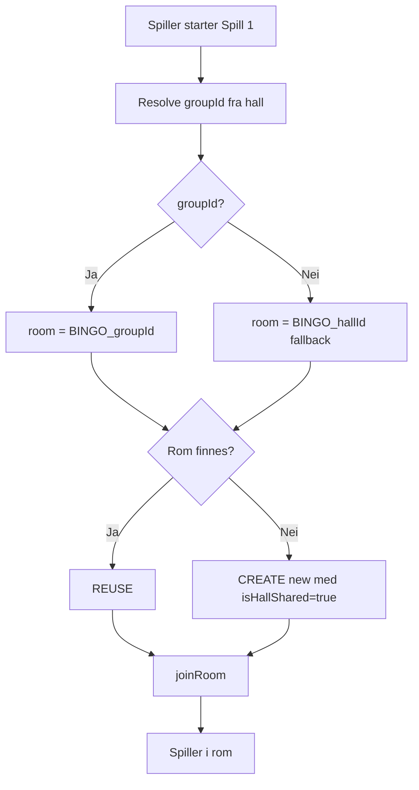

# Spillorama Rom-struktur — Definitiv referanse

**Dato:** 2026-04-27
**Status:** Definitiv kilde for rom-arkitektur i Spillorama. Erstatter alle uformelle beskrivelser. Endringer krever PM-godkjenning.

Dette dokumentet beskriver eksakt hvordan rom (rooms) er strukturert i Spillorama-systemet — single-room-per-link-enforcement, canonical-room-mapping og hall-binding for Spill 1, 2 og 3.

---

## 1. Kjerneprinsipper

### Single-Room-Per-Link

**Det skal ALDRI eksistere mer enn ett aktivt rom per (game-slug + link)-kombinasjon.**

Dette er en hard regulatorisk + UX-invariant. Hvis to rom skulle eksistere parallelt for samme spill og link, ville:
- Spillere bli fragmentert på tvers av identiske spill (dårlig UX)
- Compliance-rapporter bli inkonsistente
- Pott-akkumuleringer (Innsatsen, jackpotter) bli korrupte

### "Link" = Group of Halls

I Spillorama-terminologi er **link = `app_hall_groups`-rad** (HallGroup). Halls grupperes sammen for å dele:
- Spill-state og pott-akkumulering
- Live trekk-stream
- Cross-hall-vinnere og leaderboards

Én hall tilhører maks én aktiv gruppe (`hall_group_members.group_id`).

### Tre kategorier rom

| Kategori | Eksempel | Skope |
|---|---|---|
| **Per-Link rom** | Spill 1 (`bingo`) | Alle haller i samme Group of Halls deler ett rom |
| **Globalt rom** | Spill 2 (`rocket`), Spill 3 (`monsterbingo`) | Alle haller på platformen deler ett rom |
| **Per-Hall rom** | Ad-hoc / ukjente slugs | Hver hall har sitt eget isolerte rom (legacy fallback) |

---

## 2. Canonical Room Code-Mapping

Implementasjon i `apps/backend/src/util/canonicalRoomCode.ts`.

### Funksjonssignatur

```typescript
function getCanonicalRoomCode(
  gameSlug: string | undefined,
  hallId: string,
  groupId?: string | null,
): {
  roomCode: string;
  effectiveHallId: string | null;  // null = shared
  isHallShared: boolean;
}
```

### Mapping-tabell

| Game Slug | Game-navn | Room Code | `effectiveHallId` | `isHallShared` |
|---|---|---|---|---|
| `bingo` | Spill 1 (Norsk Bingo) | `BINGO_<groupId>` (med `<hallId>`-fallback) | `null` | `true` |
| `rocket` | Spill 2 (Rakett) | `ROCKET` | `null` | `true` |
| `monsterbingo` | Spill 3 (Monsterbingo) | `MONSTERBINGO` | `null` | `true` |
| (ukjent slug) | — | `<SLUG_UPPERCASE>` | `<hallId>` | `false` |

### Eksempler

**Eksempel 1: Spill 1 i Group "Notodden"**
- Hall A og Hall B er begge medlemmer av Group "Notodden" (`group_id: "GH_2024_notodden"`)
- Spiller fra Hall A starter Spill 1 → room: `BINGO_GH_2024_notodden`
- Spiller fra Hall B starter Spill 1 → samme room: `BINGO_GH_2024_notodden`
- ✅ Begge spillere joiner SAMME rom (samme runde, delt pot, samme trekk-stream)

**Eksempel 2: Spill 1 i annen Group "Hamar"**
- Hall C tilhører Group "Hamar" (`group_id: "GH_2024_hamar"`)
- Spiller fra Hall C starter Spill 1 → room: `BINGO_GH_2024_hamar`
- ✅ Egen runde, isolert fra Notodden-gruppen

**Eksempel 3: Hall uten group**
- Hall D har ingen aktiv gruppe-medlemskap (`hall_group_members.group_id IS NULL`)
- Spiller fra Hall D starter Spill 1 → room: `BINGO_<hallD-id>` (fallback til hallId)
- ✅ Isolert per-hall, ingen cross-hall-deling

**Eksempel 4: Spill 2 (Rocket)**
- Spillere fra Hall A (Notodden), Hall B (Notodden), Hall C (Hamar), Hall D (uten gruppe) starter alle Spill 2
- ALLE → room: `ROCKET`
- ✅ Felles globalt rom på tvers av alle haller — industri-standard for online-bingo

---

## 3. Group-of-Halls oppslag (link-resolusjon)

Når en spiller starter et Spill 1-rom, må backend resolve hallens gruppe:

```typescript
// apps/backend/src/sockets/gameEvents/roomEvents.ts (room:create handler)
const groupId = await deps.getHallGroupIdForHall?.(identity.hallId).catch(() => null);
const mapping = getCanonicalRoomCode(requestedGameSlug, identity.hallId, groupId);
```

`getHallGroupIdForHall` (definert i `apps/backend/src/index.ts`) bruker:

```typescript
async (hallId: string) => {
  const groups = await hallGroupService.list({
    hallId,
    status: "active",
    limit: 1,
  });
  return groups[0]?.id ?? null;
};
```

**Fail-soft semantikk:** Hvis oppslaget feiler (DB-utilgjengelig, hall finnes ikke, etc.) → fallback til `hallId`-basert kode. Spilleren får alltid spille; isolasjon kan bli per-hall i degraded-state.

---

## 4. HALL_MISMATCH-relaksering

Default oppførsel i `BingoEngine.joinRoom`:

```typescript
if (room.hallId !== hallId) {
  throw new DomainError("HALL_MISMATCH", "Rommet tilhører en annen hall.");
}
```

**For shared rooms (Spill 1 per-link, Spill 2/3 global)** er denne sjekken relaksert:

```typescript
if (!room.isHallShared && room.hallId !== hallId) {
  throw new DomainError("HALL_MISMATCH", "Rommet tilhører en annen hall.");
}
```

`room.isHallShared = true` flagget settes ved `createRoom` basert på canonical-mapping.

---

## 5. Lifecycle: Room Creation + Reuse

Når spiller starter spill:

1. **Backend resolver `groupId`** fra spillerens hall (fail-soft → null)
2. **Canonical mapping** beregnes basert på (slug, hallId, groupId)
3. **Eksisterende rom?**
   - Hvis room-code allerede finnes i `BingoEngine.rooms` → REUSE (ikke create)
   - Hvis ikke → opprett nytt rom med canonical code + `isHallShared` flagget
4. **Spiller joiner rommet**:
   - For shared room: HALL_MISMATCH-sjekk skipped
   - For per-hall room: HALL_MISMATCH håndhevet



---

## 6. Validering med industri-standard

Jamfør `docs/architecture/LIVE_CASINO_ROOM_ARCHITECTURE_RESEARCH_2026-04-27.md`:

| Vår modell | Industri-parallell | Validering |
|---|---|---|
| Spill 1 per-link (Group of Halls) | Authentic Gaming hybrid retail+online | ✅ Industri-standard for hybrid-modell |
| Spill 2/3 globalt delt | Playtech Virtue Fusion (15 000 spillere, 100+ operatører på delt pool) | ✅ Industri-standard for online-bingo |

---

## 7. Test-scenarier

### Scenario A: Spill 1 single-link, multi-hall
**Forutsetning:** Hall A og Hall B er begge i Group "Notodden".

1. Spiller P1 fra Hall A starter Spill 1
2. Spiller P2 fra Hall B starter Spill 1
3. Forventet:
   - Begge i samme rom `BINGO_<group-notodden-id>`
   - Begge mottar samme draw-events
   - Premier deles ved samtidig fullføring
   - Pott-akkumulering (Innsatsen) deles

### Scenario B: Spill 1 separate links
**Forutsetning:** Hall A i Group "Notodden", Hall C i Group "Hamar".

1. P1 fra Hall A starter Spill 1
2. P2 fra Hall C starter Spill 1
3. Forventet:
   - To separate rom: `BINGO_<notodden>` + `BINGO_<hamar>`
   - Egne trekk, egne pots, ingen cross-hall

### Scenario C: Spill 2 globalt
**Forutsetning:** Halls fra forskjellige grupper.

1. P1 fra Hall A (Notodden), P2 fra Hall C (Hamar), P3 uten gruppe → alle starter Spill 2
2. Forventet:
   - ALLE i samme rom `ROCKET`
   - Felles trekk, felles pott
   - HALL_MISMATCH ikke kastet (relaksert pga `isHallShared`)

### Scenario D: Spill 3 globalt
Samme som Scenario C, men room = `MONSTERBINGO`.

### Scenario E: Hall uten gruppe (fallback)
**Forutsetning:** Hall D har ingen `hall_group_members`-rad.

1. P fra Hall D starter Spill 1
2. Forventet:
   - Room = `BINGO_<hallD-id>` (fallback)
   - `isHallShared = true` (Spill 1 mapping er alltid shared, fallback bruker hallId som key)
   - Andre spillere fra Hall D kan joine samme rom
   - Spillere fra andre haller kan IKKE joine pga HALL_MISMATCH ville aktiveres på `effectiveHallId=hallId`

> **Note:** Per `getCanonicalRoomCode`-implementasjon settes `effectiveHallId=null` selv ved fallback, så også andre haller TEKNISK kan joine. I praksis er dette en edge-case som krever oppfølging hvis prod har haller uten gruppemedlemskap.

---

## 8. Vanlige misforståelser

| Misforståelse | Korreksjon |
|---|---|
| "Spill 1 er per-hall" | NEI — Spill 1 er per-LINK (Group of Halls). Alle haller i samme link deler rom. |
| "Spill 2 har ett rom per hall" | NEI — Spill 2 har ÉN GLOBAL ROM `ROCKET` på tvers av alle haller. |
| "Forskjellige Spill 1-runder kjører parallelt i samme link" | NEI — single-room-per-link. Én aktiv runde av gangen per link. |
| "Hall A og Hall B i samme link spiller separate Spill 1-runder" | NEI — de spiller samme runde, samme trekk, delt pot. |
| "BINGO1 brukes fortsatt" | NEI — gammelt. Ny mapping bruker `BINGO_<groupId>` eller `BINGO_<hallId>`. |
| "groupId er kjent på rom-objektet" | NEI — kun room-code (`BINGO_<groupId>`) er kjent. groupId derives ved oppslag i `app_hall_group_members`. |

---

## 9. Implementasjon — referanse-filer

| Komponent | Fil |
|---|---|
| Canonical-mapping helper | `apps/backend/src/util/canonicalRoomCode.ts` |
| Tester | `apps/backend/src/util/canonicalRoomCode.test.ts` (12 tester) |
| Room creation handler | `apps/backend/src/sockets/gameEvents/roomEvents.ts` (`room:create` event) |
| Group-of-Halls service | `apps/backend/src/admin/HallGroupService.ts` |
| Wiring | `apps/backend/src/index.ts` (deps for `getHallGroupIdForHall`) |
| BingoEngine HALL_MISMATCH-relaksering | `apps/backend/src/game/BingoEngine.ts` (`joinRoom`) |
| Room-state shape | `apps/backend/src/game/types.ts` (`RoomState.isHallShared`) |
| Migrasjon for hall-groups | `apps/backend/migrations/20260424000000_hall_groups.sql` |
| Migrasjon for hall-group-members | Samme fil, `app_hall_group_members` tabellen |

---

## 10. Tilhørende konvensjoner

### Rom-kode-format

| Spill | Format | Eksempler |
|---|---|---|
| Spill 1 | `BINGO_<groupId-eller-hallId>` | `BINGO_GH_2024_notodden`, `BINGO_hall-c4a191fc` |
| Spill 2 | `ROCKET` | (alltid) |
| Spill 3 | `MONSTERBINGO` | (alltid) |
| Andre/ukjent | `<SLUG_UPPERCASE>` | `KVIKKIS`, `SPINNGO` |

### Default-Slug

Hvis `gameSlug` er `undefined` eller tom string → tolkes som `bingo` (Spill 1).

### Persistens

Room-state lever i:
1. **In-memory** (`BingoEngine.rooms` Map) — fast access
2. **Postgres room-state-checkpoints** — persistens på tvers av deploys
3. **Redis** (hvis `REDIS_URL` satt) — distributed-state for multi-instance deploys

---

## 11. Followups + kjente kanter

### Pre-existing arkitektur-egenskap

`getPrimaryRoomForHall(hallId)` filterer på `summary.hallId === hallId`. For shared-rooms hvor `effectiveHallId = null`, vil hjelpemetoden ikke finne rommet. Dette er en pre-existing egenskap som gjelder Spill 2/3 (global) og nå også Spill 1 (per-link).

**Implikasjon:** Hvis Hall B er i samme gruppe som Hall A og Hall A skapte Spill 1-rom, ville Hall B's `room:create`-handler ikke "se" eksisterende rom via `getPrimaryRoomForHall(hallB)`, men direkte room-code-lookup (`BingoEngine.rooms.get("BINGO_<groupId>")`) vil finne det. Det er denne path-en som brukes i praksis — `getPrimaryRoomForHall` er backup.

**Status:** Sporet for follow-up, ikke pilot-blokker.

### Capacity og parallell-instans

Per casino-research (Evolution-mønster): når et delt rom når peak (40 000+ spillere), spawn parallell-instanser. Spillorama har ikke dette ennå — vil trenge før kommersiell launch hvis Spill 2/3 skal håndtere flere tusen samtidige spillere.

---

## 12. Endringslogg

| Dato | PR | Endring |
|---|---|---|
| 2026-04-27 | #615 | Initial canonical-room-helper. Spill 1 BINGO1, Spill 2 ROCKET, Spill 3 MONSTERBINGO |
| 2026-04-27 | #617 | Spill 1 endret fra `BINGO1` (per-hall) til `BINGO_<groupId>` (per-link/Group of Halls) |
| 2026-04-27 | #616 | Casino-research dokumentert i separat fil |

---

## 13. For nestemann

Hvis du er i tvil om hvordan rom skal struktureres:
1. **Spill 1**: per-link (alle haller i samme Group of Halls deler rom)
2. **Spill 2 / Spill 3**: globalt (alle haller deler ett rom)
3. **Aldri 2 aktive rom for samme (slug + link)**
4. **HALL_MISMATCH skipped for shared rooms** (`isHallShared = true`)

Hvis fortsatt usikker: spør PM før du endrer `getCanonicalRoomCode` eller relatert logikk.
