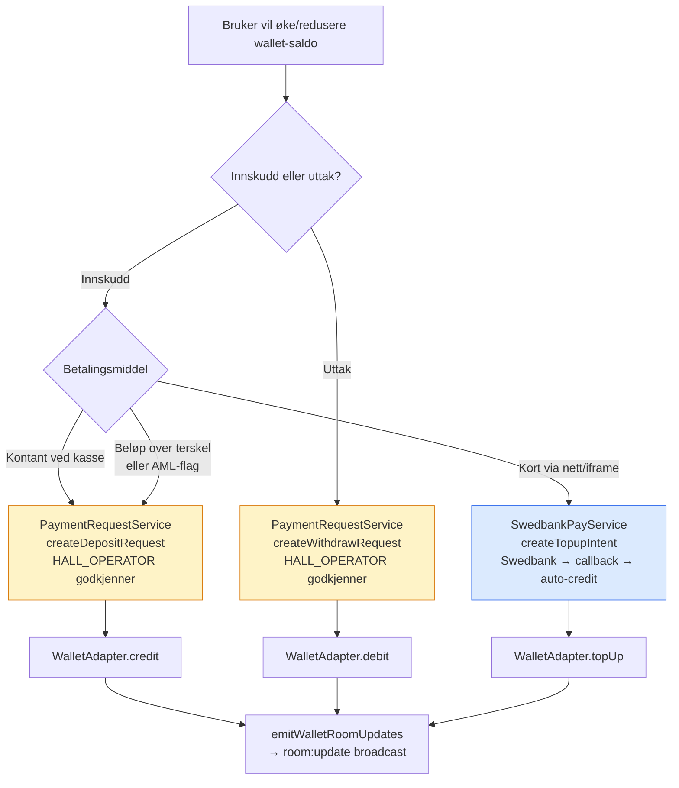
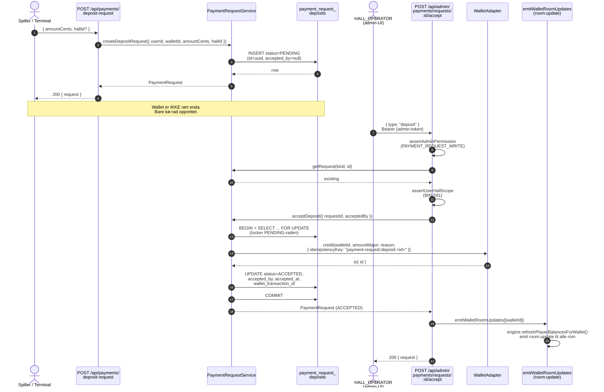
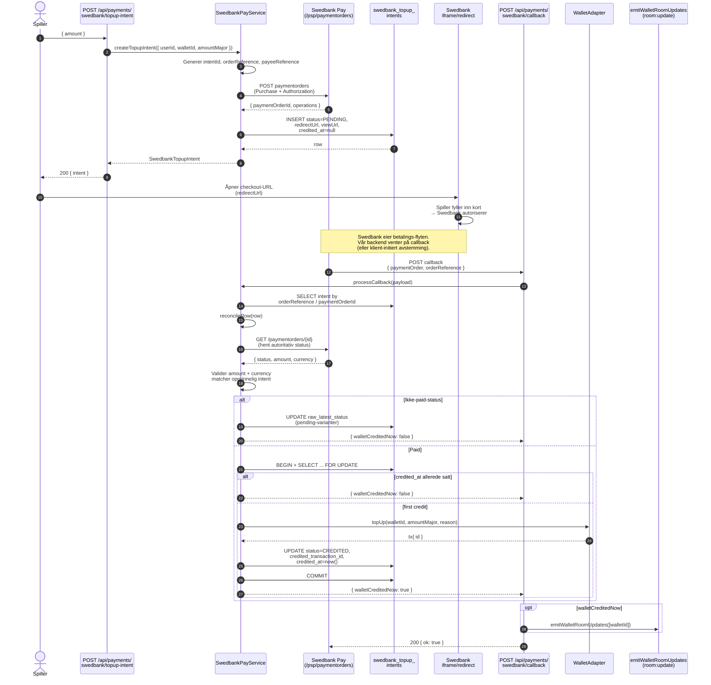

# Payment Flows — Arkitektur

**Issue:** [BIN-593](https://linear.app/bingosystem/issue/BIN-593)
**Parent:** [BIN-586](https://linear.app/bingosystem/issue/BIN-586) (backend-portering av deposit/withdraw-kø)
**Sist oppdatert:** 2026-04-18

Dette dokumentet forklarer hvordan de to betalings-systemene i backend henger sammen, og er ment for nye utviklere som skal gjøre endringer i wallet- eller payment-kjeden.

## TL;DR

- **`PaymentRequestService`** håndterer **manuell kontant** (kasse) og **manuell bank-basert uttak**. Operatør må godkjenne hver enkelt forespørsel i admin-UI.
- **`SwedbankPayService`** håndterer **automatiske kort-innskudd** via Swedbank Pay Checkout. Wallet-kreditering skjer via callback eller klient-initiert avstemming.
- Begge tjenester er byggeklosser over den samme `WalletAdapter` — wallet-ledger er felles sannhetskilde.
- Det finnes **ingen refund-flyt** og **ingen webhook-signaturverifisering** per 2026-04-18. Se [§ Gaps](#gaps).

---

## 1. Når brukes hvilken tjeneste

**Tommelfingerregler:**

| Situasjon | Rute |
|---|---|
| Spiller leverer kontanter ved hall-kasse | **Manuell** — kvitter opp i admin-UI |
| Spiller taster inn kort i Swedbank-iframe på nett | **Automatisk** — wallet krediteres av webhook |
| Uttak (alltid mot bankkonto/Swedbank Payout ikke implementert) | **Manuell** — HALL_OPERATOR utbetaler mot ID |
| Kort-betaling feiler eller henger | Spiller må re-trigge avstemming via `/api/payments/swedbank/confirm` eller `GET /intents/:id?refresh=1` |
| Beløp overstiger RG-terskel eller flagg | **Manuell** (ingen auto-gate implementert enda — se [§ Gaps](#gaps)) |

---

## 2. Manuell kontant-innskudd (PaymentRequestService)

**Bruk:** Spiller leverer kontant ved hall-kasse. Terminal-bruker (hall-operatør eller spilleren selv på en terminal) oppretter en pending request. HALL_OPERATOR godkjenner i admin-UI, og wallet krediteres først på det tidspunktet.

### Uttak (withdraw) — variant

Samme flyt som innskudd, men:
- Endepunkt: `POST /api/payments/withdraw-request` → `createWithdrawRequest` → tabell `payment_request_withdraws`
- Admin-accept kaller `acceptWithdraw` som kjører `WalletAdapter.debit` (ikke `credit`)
- Idempotency-nøkkel: `payment-request:withdraw:<id>`
- Alt annet identisk: SELECT FOR UPDATE, status-transisjon PENDING → ACCEPTED/REJECTED, socket-broadcast

Se [`PaymentRequestService.ts:285-291`](../../apps/backend/src/payments/PaymentRequestService.ts) for `acceptWithdraw`/`rejectWithdraw`-tvillingmetodene.

### Avvis (reject) — begge retninger

Operatør kan avvise med påkrevd begrunnelse:
- `POST /api/admin/payments/requests/:id/reject { type, reason }`
- Wallet blir **aldri** rørt — raden oppdateres til `status=REJECTED`, `rejection_reason`, `rejected_by`, `rejected_at`
- Samme hall-scope-sjekk som accept (BIN-591)

---

## 3. Automatisk kort-innskudd (SwedbankPayService)

**Bruk:** Spiller fyller på wallet med kort via Swedbank Pay Checkout. Backend oppretter en **top-up intent** som Swedbank eier; Swedbank sender callback når betaling er ferdig, og wallet krediteres automatisk. Klienten kan også be om manuell avstemming hvis callback er forsinket.

### Klient-initiert avstemming (fallback for forsinket callback)

Hvis Swedbank-callback ikke kommer (nettverksfeil, delay), kan klienten trigge avstemming manuelt:

- `POST /api/payments/swedbank/confirm { intentId }` — reconcileIntentForUser gjør samme fetch-og-valider-flyt som callback
- `GET /api/payments/swedbank/intents/:intentId?refresh=true` — samme effekt, designet for polling fra UI
- Begge går gjennom `reconcileRow()`, så idempotency-garantien (`credited_at != null` → no-op) holder

Se [`payments.ts:45-81`](../../apps/backend/src/routes/payments.ts) for klient-endepunktene.

---

## 4. Idempotency

Begge tjenester garanterer **ingen dobbel-kreditering/-debitering** selv om samme accept/callback kommer flere ganger.

| Operasjon | Mekanisme |
|---|---|
| `PaymentRequestService.acceptDeposit` | String-nøkkel `payment-request:deposit:<id>` sendt til `walletAdapter.credit`. WalletAdapter enforcer uniqueness i `wallet_transactions`-tabellen. |
| `PaymentRequestService.acceptWithdraw` | String-nøkkel `payment-request:withdraw:<id>` |
| `SwedbankPayService.reconcileRow` | Dobbel beskyttelse: (a) `SELECT … FOR UPDATE` low-lock på intent-raden, (b) tidlig retur hvis `credited_at` er satt. Ingen string-nøkkel trenges — DB-row er unikhetsskranken. |

**Konsekvens:** En akseptert PaymentRequest kan ikke re-aksepteres (status-guard + row-lock). En credited Swedbank-intent returnerer `walletCreditedNow=false` på re-calls.

---

## 5. Audit-trail

**Status per 2026-04-18:** Betalings-tabellene er selv audit-trailen. Ingen kall til sentral `AuditLogService` enda.

| Felt | Kilde | Hva det svarer på |
|---|---|---|
| `accepted_by`, `accepted_at` | `payment_request_{deposits,withdraws}` | Hvem godkjente, når |
| `rejected_by`, `rejected_at`, `rejection_reason` | `payment_request_{deposits,withdraws}` | Hvem avviste, når, hvorfor |
| `wallet_transaction_id` | → `wallet_transactions` | Link til ledger-entry (beløp, reason, idempotency-key) |
| `credited_at`, `credited_transaction_id` | `swedbank_topup_intents` | Når kort-betaling ble kreditert wallet |
| `raw_latest_status` | `swedbank_topup_intents` (JSONB) | Hele Swedbank-paymentOrder-payload; nyttig for support |
| `log.info` strukturert logg | `[BIN-586] payment request accepted/rejected/created` | Stdout + Sentry-breadcrumb |

**TODO (`BIN-588`):** Rute begge tjenestene gjennom `AuditLogService` slik at admin-UI får ett samlet audit-søk på tvers av authentication-events, payment-events og RG-events. Se `[TODO (BIN-588): sentralisert audit-log]`-kommentarer i [`PaymentRequestService.ts:390,449`](../../apps/backend/src/payments/PaymentRequestService.ts).

---

## 6. Fil-referanser

| Aktør | Fil |
|---|---|
| Spiller-endepunkter (kontant) | [`apps/backend/src/routes/paymentRequests.ts:251,272`](../../apps/backend/src/routes/paymentRequests.ts) |
| Admin-endepunkter (accept/reject) | [`apps/backend/src/routes/paymentRequests.ts:143,173,209`](../../apps/backend/src/routes/paymentRequests.ts) |
| Kontant-service | [`apps/backend/src/payments/PaymentRequestService.ts`](../../apps/backend/src/payments/PaymentRequestService.ts) |
| Spiller-endepunkter (kort) | [`apps/backend/src/routes/payments.ts:29,45,59`](../../apps/backend/src/routes/payments.ts) |
| Callback-endepunkt (kort) | [`apps/backend/src/routes/payments.ts:83`](../../apps/backend/src/routes/payments.ts) |
| Kort-service | [`apps/backend/src/payments/SwedbankPayService.ts`](../../apps/backend/src/payments/SwedbankPayService.ts) |
| Wallet-ledger (felles) | [`apps/backend/src/adapters/WalletAdapter.ts`](../../apps/backend/src/adapters/WalletAdapter.ts) |
| RBAC-policy | [`apps/backend/src/platform/AdminAccessPolicy.ts:32`](../../apps/backend/src/platform/AdminAccessPolicy.ts) (`PAYMENT_REQUEST_READ`/`WRITE`) |
| Hall-scope-håndhevelse | [`apps/backend/src/routes/paymentRequests.ts:152,181`](../../apps/backend/src/routes/paymentRequests.ts) (BIN-591) |
| Admin-UI | [`apps/admin-web/index.html#section-payment-requests`](../../apps/admin-web/index.html) + [`apps/admin-web/app.js:loadPaymentRequests`](../../apps/admin-web/app.js) (BIN-589) |
| Broadcast | [`apps/backend/src/index.ts:274 emitWalletRoomUpdates`](../../apps/backend/src/index.ts) |

---

## 7. Gaps

Dette er **ikke implementert** per 2026-04-18 — flaggede for fremtidige issues:

- **Refund-flyt.** Hverken PaymentRequestService eller SwedbankPayService har refund-stier. Manuelle tilbakebetalinger håndteres i dag via `WalletAdapter.debit` fra admin direkte, uten at original-transaksjonen lenkes. Gap eskaleres hvis Lotteritilsynet krever full refund-sporing.
- **Swedbank webhook-signaturverifisering.** `processCallback` leser callback-body og sammenligner *direkte mot Swedbank API* (fetch `/paymentorders/{id}`). Ingen HMAC/JWT-sjekk av selve webhook-payloaden. Sikkerhetsmessig OK fordi wallet-kreditering kun skjer etter verifisert API-respons, men webhook-endepunktet er eksponert åpent på nettet — bør flagges i sikkerhetsaudit (BIN-592 eller senere).
- **Sentral `AuditLogService`-integrasjon.** Se `[TODO (BIN-588)]`-kommentarene. P.t. er strukturert `log.info` + tabell-feltene audit-dekningen.
- **Auto-escalation til manuell gate ved AML/RG-terskel.** Ingen kode-gate som tvinger kort-innskudd over N NOK gjennom manuell godkjenning. Hvis pilot krever dette, må det inn før go-live. Pr i dag stoler vi på at RG-grenser i WalletAdapter (BIN-541) blokkerer ulovlige beløp *etter* kreditering — som i praksis betyr at Swedbank-intenten godtas men spill blokkeres av Spillevett. Akseptabelt for pilot, ikke for prod.
- **Payout-flyt til bankkonto.** Uttak i `PaymentRequestService` gir kun wallet-debit, ikke faktisk penge-utbetaling. HALL_OPERATOR må utbetale kontant ved hall-kasse. Swedbank Payout API er ikke integrert.

---

## 8. Relaterte issues

- [BIN-586](https://linear.app/bingosystem/issue/BIN-586): portering av backend-flyten (merget — fullført)
- [BIN-587](https://linear.app/bingosystem/issue/BIN-587): admin HTTP-rute-paritet (pågår, player-account sletting flyttet hit)
- [BIN-588](https://linear.app/bingosystem/issue/BIN-588): sentralisert audit-log (åpen)
- [BIN-589](https://linear.app/bingosystem/issue/BIN-589): admin-UI for payment-requests (merget — fullført)
- [BIN-591](https://linear.app/bingosystem/issue/BIN-591): HALL_OPERATOR hall-scope enforcement (merget — fullført)
- [BIN-592](https://linear.app/bingosystem/issue/BIN-592): sikkerhets-audit (foreslått, ikke opprettet — se [§ Gaps](#gaps))
