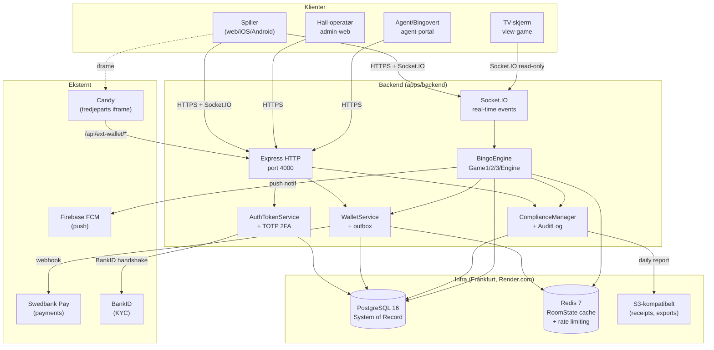

# Diagram 1: System Tiers

**Sist oppdatert:** 2026-05-06

Spillorama er tre-tier:
1. **Klient** — Pixi.js game-client + admin-web + agent-portal
2. **Backend** — Express + Socket.IO på Node.js 22
3. **Infrastruktur** — Postgres 16 + Redis 7

## Nøkkel-elementer

- **Frontmost prinsipp:** Server er sannhets-kilde. Klienter er view.
- **Postgres:** System of Record for alt regulatorisk
- **Redis:** Ephemeral cache for RoomState, sessions, rate-limits
- **Socket.IO:** Real-time event-fan-out til klienter
- **Candy:** Tredjeparts iframe — vi eier kun launch + wallet-bro

## Skalering

- 36 000 samtidige Socket.IO-tilkoblinger på pilot-skala
- Postgres connection-pool tunet for 200 konkurrente queries
- Redis pub/sub for cross-instance bredkast (når vi går horizontal)
