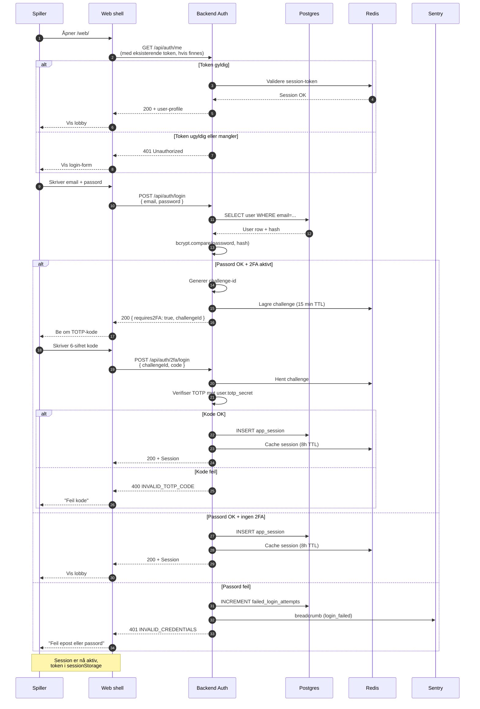

# Diagram 2: Login Flow

**Sist oppdatert:** 2026-05-06

Spiller-autentisering ende-til-ende. Støtter både e-post + passord OG telefon + PIN (REQ-130).
TOTP 2FA er valgfritt (REQ-129).

## Sikkerhets-tiltak

- **Rate-limit:** 5 forsøk per IP per 15 min på login
- **Brute-force-lock:** etter 10 feilet forsøk per bruker, lås i 30 min
- **Bcrypt cost-faktor:** 12 (justert ved CPU-oppgradering)
- **TOTP backup-codes:** 10 stk single-use, generert ved 2FA-setup
- **Session-revoke:** logout invalidate token i Redis + DB

## REQ-referanser

- REQ-129: TOTP 2FA
- REQ-130: Phone + PIN login
- REQ-132: Active sessions listing + logout-all

## Feilkoder

- `INVALID_CREDENTIALS` — feil email/passord
- `INVALID_TOTP_CODE` — feil 2FA-kode
- `INVALID_TWO_FA_CHALLENGE` — utløpt 2FA-challenge
- `ACCOUNT_LOCKED` — låst etter for mange forsøk
- `KYC_REQUIRED` — bruker må fullføre KYC før spill
