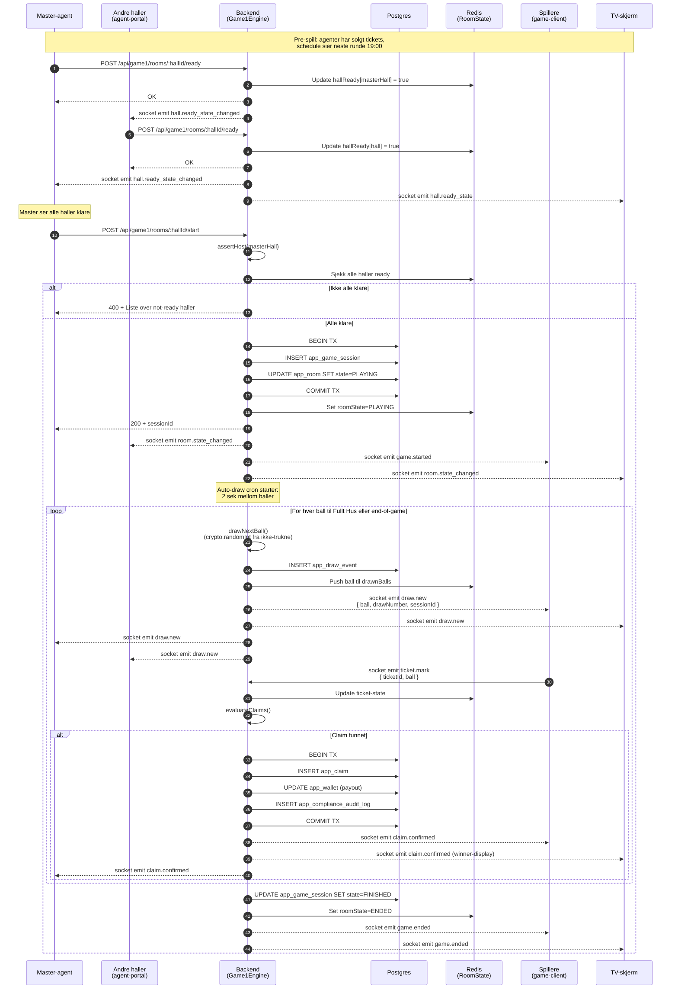

# Diagram 3: Draw Flow — Spill 1 (Master-styrt)

**Sist oppdatert:** 2026-05-06

Spill 1 (`bingo`) er master-styrt per hall. Bingovert i master-hallen klikker "Start Next Game",
andre haller signaliserer "Ready", og draw-engine begynner å trekke baller.

Se ADR-001 for hvorfor Spill 1 er per-hall master-styrt mens Spill 2/3 er global perpetual.

## Master-hall responsibility

Master-hallen styrer kun **rundens timing** — ikke selve trekningene. Trekningene er rene
crypto.randomInt fra ikke-trukne-baller, bundet til sessionId.

Master kan:
- Trigger "Start Next Game" når alle haller signalerer ready
- Trigger "Pause" mid-runde for bingo-check
- Trigger "End Round" hvis alt blir kaos

Master kan IKKE:
- Hoppe over baller eller manipulere RNG
- Avgjøre claims (det er BingoEngine sin jobb)
- Endre payout-policy mid-runde

## Master-handover

Hvis master-hallen blir offline mid-runde, kan annen hall ta over via `transferHallAccess`-handshake.
Se [Diagram 5: Master-handover](./05-master-handover.md).

## Compliance-binding

Hver claim binder ComplianceLedger-rad til **kjøpe-hallen** (ikke master-hallen). Dette er BIN-661 fix
(PR #443) — viktig for §71 hall-rapport.

Se ADR-002 (system-actor) og ADR-007 (spillkatalog).

## Referanser

- `apps/backend/src/game/Game1RoomFactory.ts`
- `apps/backend/src/game/Game1HallReadyService.ts`
- `apps/backend/src/game/Game1AutoDrawTickService.ts`
- `apps/backend/src/game/Game1DrawEngineService.ts`
- ADR-001 (perpetual vs master)
- ADR-002 (system-actor)
