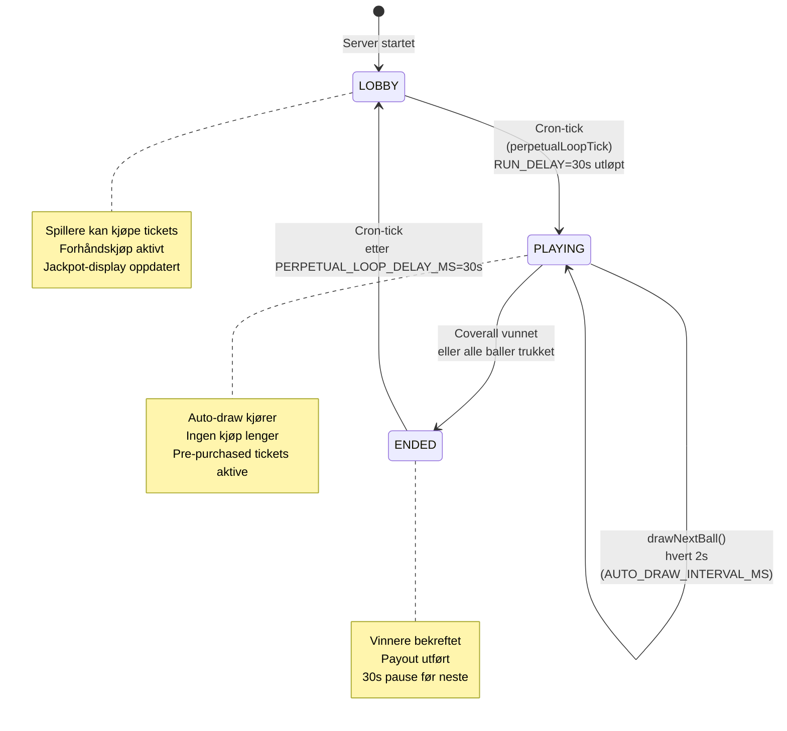
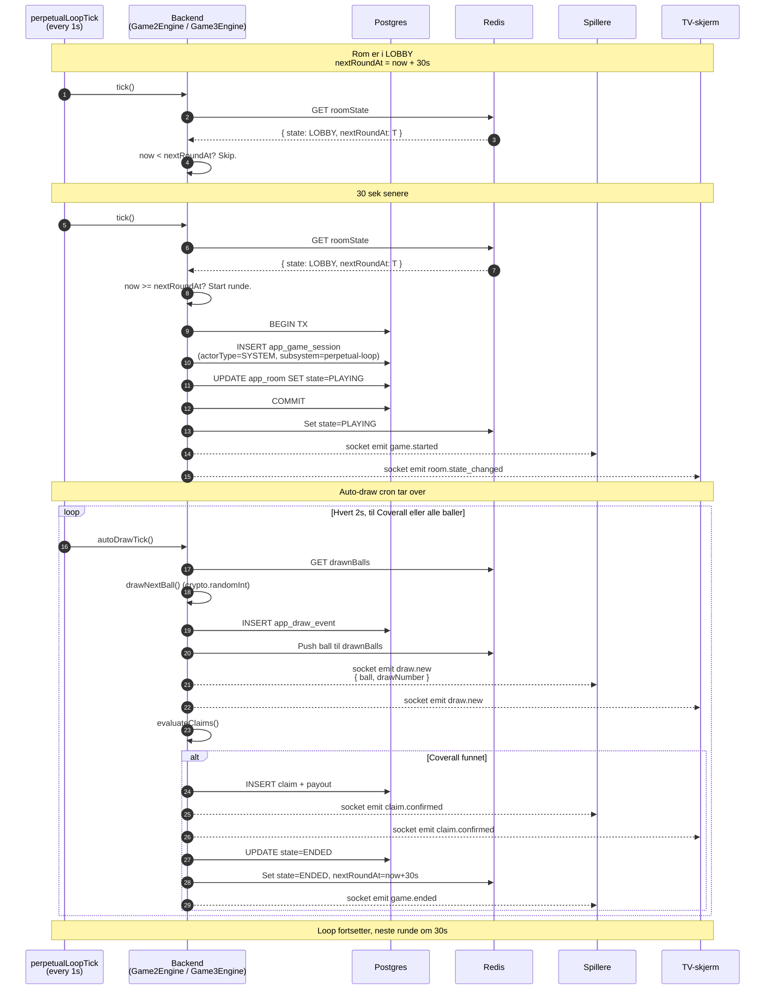

# Diagram 4: Perpetual Loop — Spill 2 og 3 (System-driven)

**Sist oppdatert:** 2026-05-06

Spill 2 (`rocket`) og Spill 3 (`monsterbingo`) bruker ETT globalt rom per spill — ikke per hall.
Loop er drevet av cron-tick (system-actor), ikke av menneskelig handler.

Se [ADR-001](../decisions/ADR-001-perpetual-room-model-spill2-3.md) for begrunnelse.



## Cron-tick-flyt



## Hvorfor system-actor?

Spill 2/3 har ingen "host" — ingen menneske trykker "start". Cron-tick produserer eventet, så audit-log
må reflektere det:

```typescript
auditLog.write({
  actorType: "SYSTEM",
  actorId: null,
  details: {
    subsystem: "perpetual-loop",
    sessionId: "..."
  },
  action: "game.started",
  resource: "game_session"
});
```

Se ADR-002 for full begrunnelse.

## Globalt rom — én RoomState

I motsetning til Spill 1 (én RoomState per hall), Spill 2 og 3 har **kun én** RoomState hver, identifisert
av room-code:

- `ROCKET` (Spill 2)
- `MONSTERBINGO` (Spill 3)

Alle spillere uansett hall ser samme trekning samtidig. Compliance-ledger binder fortsatt kjøp til
spillerens hall (ADR-007 §11).

## Ingen `assertHost`

Pre-pilot-bug #942 var Spill 2/3 som arvet `assertHost`-check fra Spill 1 — men perpetual-rom har
ingen host. Fix: skip assertHost for perpetual-spill.

## Konfigurasjon

| Konstant | Verdi | Funksjon |
|---|---|---|
| `PERPETUAL_LOOP_DELAY_MS` | 30000 (30s) | Pause mellom runder |
| `AUTO_DRAW_INTERVAL_MS` | 2000 (2s) | Mellom baller |
| `PRE_ROUND_PURCHASE_WINDOW_MS` | 30000 (30s) | Forhåndskjøps-vindu |

## Referanser

- `apps/backend/src/game/Game2RoomFactory.ts`
- `apps/backend/src/game/Game3Engine.ts`
- `apps/backend/src/jobs/perpetualLoopTickCron.ts`
- ADR-001 (perpetual vs master)
- ADR-002 (system-actor)
- PR [#942](https://github.com/tobias363/Spillorama-system/pull/942) (skip assertHost)
