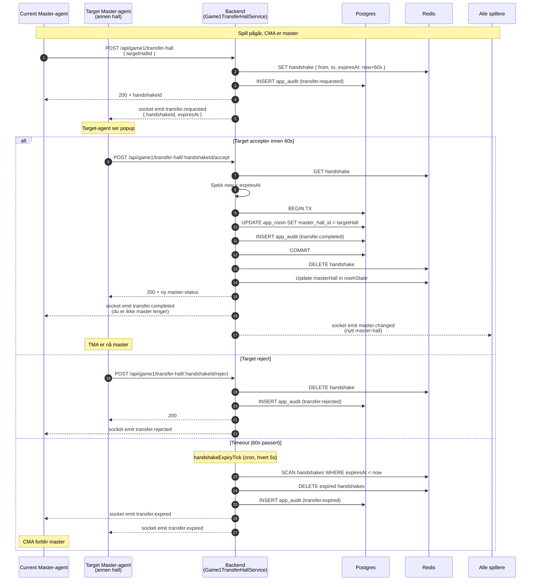

# Diagram 5: Master-handover

**Sist oppdatert:** 2026-05-06

Spill 1 (Spill 1, master-styrt per hall) støtter overføring av master-kontroll mellom haller med 60s
handshake. Brukes når master-hallen blir uoperasjonell (agent slutter skift, hall stenger, network-issue).

Implementert i `Game1TransferHallService.ts` (PR #453).

## Sikkerhet

- **Audit-trail:** alle handshake-events logges (requested/completed/rejected/expired)
- **TTL i Redis:** 60s expire forhindrer dangling handshakes
- **Permission-check:** kun ADMIN-role eller designert hall-master kan trigge transfer
- **Race-protection:** Postgres TX sikrer at to samtidige accept-er ikke begge får master

## Auto-eskalering

Hvis master-hall ikke responderer på `hall.ready_state` event innen X sekunder, og runde er stuck i
`ready_to_start`-state, kjører `game1ScheduleTick`-cron og eskalerer:

1. Forsøker å pinge master-hall via socket
2. Hvis ingen respons: marker master-hall som disconnected
3. Velger ny master automatisk (første hall i ready-listen alfabetisk)
4. Logger eskaleringen som SYSTEM-actor

Se BIN-XXX og `apps/backend/src/jobs/game1ScheduleTickCron.ts`.

## Hvorfor 60 sekunder?

- Kort nok til at spillet ikke henger lenge
- Lang nok til at agent kan se popup, vurdere, klikke accept/reject
- Industri-norm (Playtech bingo bruker 30-90s)

## Pilot-blokker (lukket)

PR #453 var pilot-blokker — uten transfer-handover kunne master-hall-disconnect føre til DB-admin-job
mid-runde. Nå håndterer systemet det automatisk.

## Referanser

- `apps/backend/src/game/Game1TransferHallService.ts`
- `apps/backend/src/jobs/handshakeExpiryTick.ts`
- PR [#453](https://github.com/tobias363/Spillorama-system/pull/453) — initial implementasjon
- `docs/architecture/MASTER_PLAN_SPILL1_PILOT_2026-04-24.md` §1.4 (hvorfor pilot-blokker)
